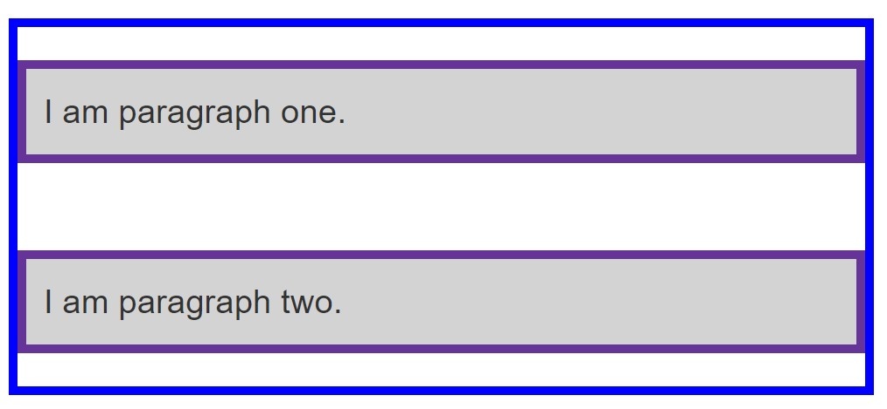
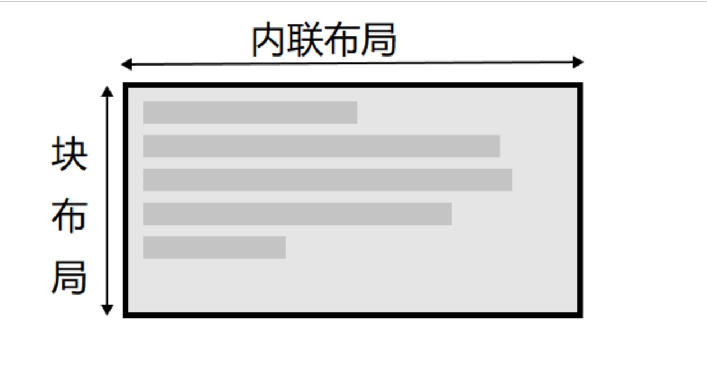
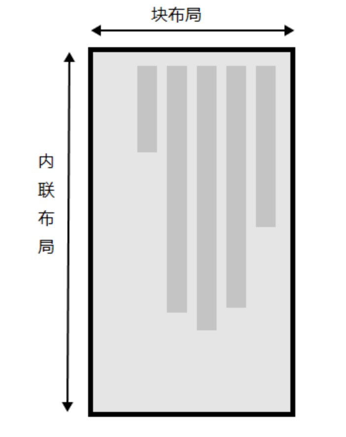
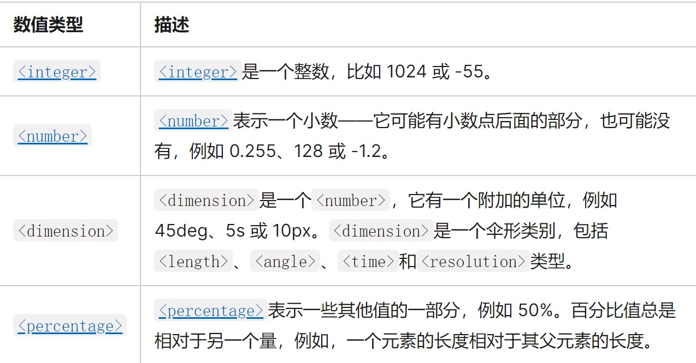
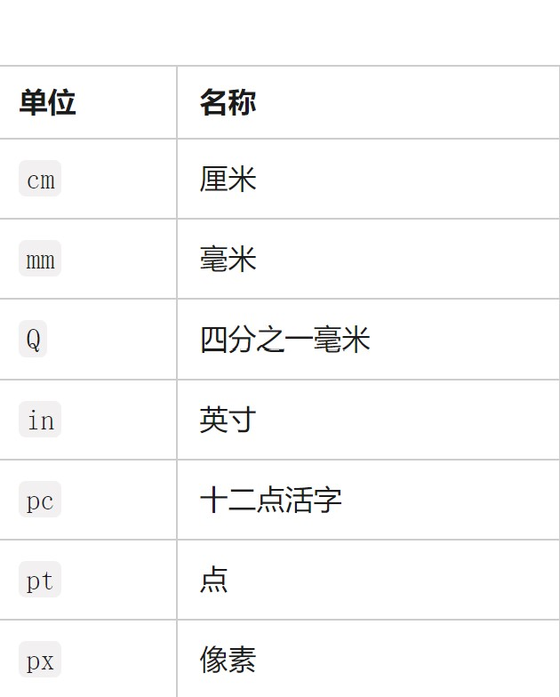
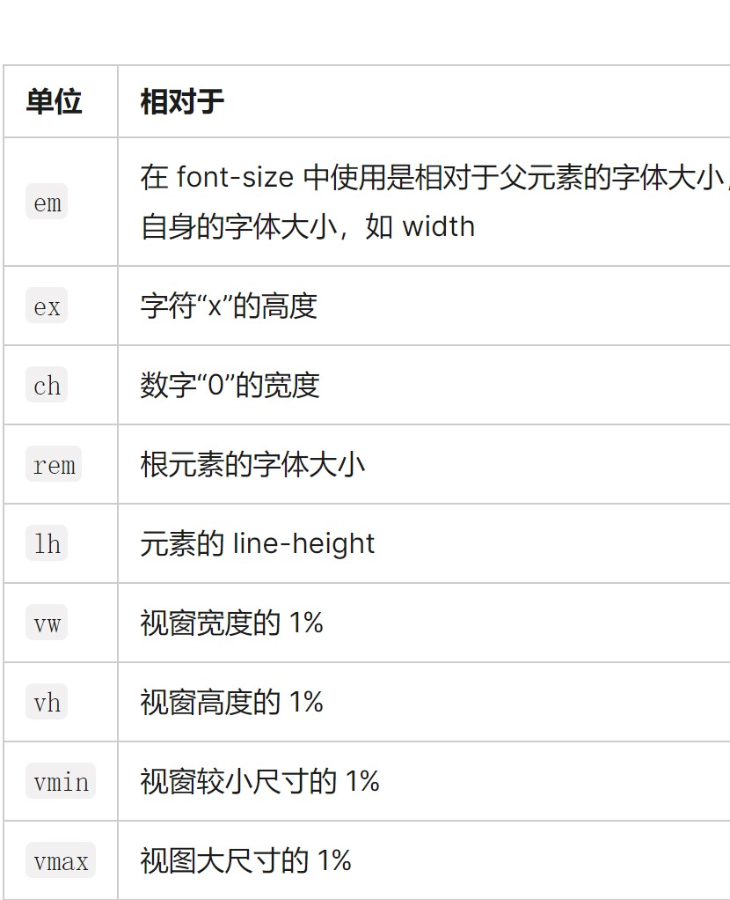
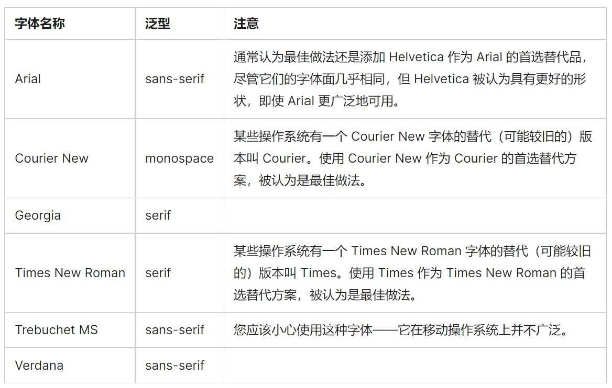
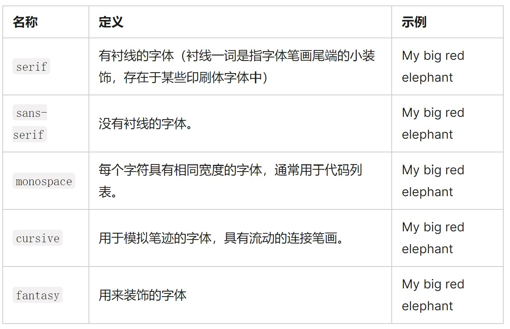

# css基础知识
## 层叠与继承
优先级：内联style样式>ID选择器>类选择器、属性选择器、伪类>元素、伪元素选择器
!important能够覆盖所有普通规则的层叠（最好不要）
* --background-color: white !important;
相互冲突的声明将按以下顺序适用，后一种声明将覆盖前一种声明：
* 用户代理样式表中的声明 (例如，浏览器的默认样式，在没有设置其他样式时使用)。
* 用户样式表中的常规声明 (由用户设置的自定义样式)。
* 作者样式表中的常规声明 (这些是我们 web 开发人员设置的样式)。
* 作者样式表中的!important声明I
* 用户样式表中的!important 声明
## CSS选择器
### 全局选择器
* \# {} 
 ```
 article *:first-child {} 选择article元素的第一子元素
 ```
### 类型、类、ID选择器
* h1 {}
* .class {}
* #id {}
### 属性选择器
#### 存否和值选择器
* 存否和值选择器允许基于一个元素自身是否存在（例如href）或者基于各式不同的按属性值的匹配，来选取元素
* [attr]   
* [attr=value]  
* [attr|=value]
* [attr~=value]   
```                                
  li[class] {
    font-size: 200%;
}

li[class="a"] {
    background-color: yellow;
}

li[class~="a"] {
    color: red;
}
```        
### 子字符串匹配选择器   
* [attr^=value]
* [attr$=value] 
* [attr*=value]    
  ```
li[class^="a"]----匹配了任何值开头为a的属性
li[class$="a"]----匹配了任何值结尾为a的属性
li[class*="a"]----匹配了任何值的字符串中出现了a的属性
    ```  
### 大小写敏感--“i”值
```
li[class^="a" i]
```
### 伪类和伪元素
伪类就是开头为“:”的关键字
伪元素 “::”开头的表现得是像往标记文本中加入全新的 HTML 元素一样
* a:hover {}
* p:first-chlid {}
* p:first-chlid::first-line {}
......
#### 用户行为伪类
* :link
* :visited
* :hover
* :focus
```
a:link,
a:visited {
    color: rebeccapurple;
    font-weight: bold;
}

a:hover {
    color:hotpink;
}
```
* article p::first-line {}
* ::before--与content一同使用，在文档中插入内容
```            
 .box::before {
    content: "This should show before the other content."
}
```
### 关系选择器
#### 后代关系选择器--"空格"
空格字符组合选择器
```
.box p {
    color: red;
}  
```
#### 子代关系选择器--">"
```
ul > li {
    border-top: 5px solid red;
}  
练习的时候使用“color”，会对所有li生效 存疑
```
#### 邻接兄弟选择器--"+"
```
h1 + p {
    font-weight: bold;
    background-color: #333;
    color: #fff;
    padding: .5em;
}  
```
#### 通用兄弟选择器--"~"
```
h1 ~ p {
    font-weight: bold;
    background-color: #333;
    color: #fff;
    padding: .5em;
}
```
## CSS盒模型
### 块级盒子和内联盒子
#### 块级盒子
* 块级盒子`block box`，块级盒子其实就是可以包含文本、块级、行内元素
* 盒子会在内联的方向上扩展并占据父容器在该方向上的所有可用空间，在绝大数情况下意味着盒子会和父容器一样宽
* 每个盒子都会换行
* width 和 height 属性可以用
* 内边距（padding）, 外边距（margin）和边框（border）会将其他元素从当前盒子周围“推开”
* 块级元素一般都是块级盒子
#### 内联盒子
* 内联盒子`inline box`，内联盒子只能包含文本和行内元素
* 盒子不会产生换行
 * width 和 height 属性不可用
*垂直方向的内边距、外边距以及边框会被应用但是不会把其他处于 inline 状态的盒子推开
* 水平方向的内边距、外边距以及边框会被应用且会把其他处于 inline 状态的盒子推开
* 行内元素默认都是内联盒子
```
-:|-:|
.box {                   .box{                 
  display: bolck;          display:inline;     
}                         }                     
  显示为块级盒子          显示为内联盒子
                         inline时width和height属性不可用        
```
### CSS中块级盒子组成部分
|  组成部分   | 含义                       |      大小控制 |
| :---------: | :------------------------- | ------------: |
| content box | 显示内容                   | width、height |
| padding box | 包围在内容区域外的空白区域 |   padding属性 |
| border box  | 包裹内容和内边距           |    border属性 |
| margin box  | 最外面的区域               |    margin属性 |

* 标准盒模型`box-sizing: content-box`，它的width就是content的width，盒子的的大小：content + padding + border，盒子大小以内容为先，自动扩展，子元素可以撑开父元素，大小随内容的变化而变化。
（margin影响的是盒子外部空间，不计入盒子大小）

替代(IE)盒模型
* 默认使用的是标准盒模型，可设置`box-sizing: border-box`来使用替代模型
```
.box {
    box-sizing: border-box;
}
```
* 替代盒模型大小：，父元素的盒模型确定之后，子元素就无法撑开父元素的盒模型，就像铁箱子，大小不能被内容改变。
* 盒模型在定义width宽度后，后面写padding和border是会改变盒子实际大小。如果需要保持固定大小，需要进行计算。
* 替代模型在定义width宽度后，不管怎么写padding和border宽度都固定在书写时的width。但是有可能导致内容被压缩，导致布局异常。
### 外边距、内边距和边框
#### 外边距 
* margin：盒子周围一圈看不到的空间，将其他元素从盒子旁边推开。值可正可负，负值时会与其他内容重叠。在计算可见部分后额外添加。
* margin-top; margin-right; margin-bottom; margin-left;
* 外边距折叠：若有两个外边距相接的元素，这些外边距将合并为一个外边距，即最大的单个外边距的大小

#### 边框
* border：在边距和填充框之间
* border-width；border-style；border-color。可设置单边也可设置多边
#### 内边距
* padding：边框和内容区域之间，必须为0或正值，将内容推离边框
* padding-top/right/bottom/left
### display: inline-block
* display: inline-block,`width`和`height`属性可用
* `padding`，`margin`，`border`会推开其他元素
* 不会跳转到新行
## 背景和边框
### background-image
* 会显示在background-color上层
* background-repeat：控制图像平铺
  * background-repeat: no-repeat;  不重复
  * background-repeat: repeat-x/y; 水平/垂直重复
  * background-repeat: repeat;     两个方向重复
* background-size: 调整图像大小
  * background-size: cover   不保留百分比
  * background-size: contain 保留百分比使图像留在框里
* background-position：背景图像定位（默认背景位置值是0，0）
  * 最常见，(x,y)
  * 可用关键字； 长度值；百分比或者混合使用
  * background-position: top center;
  * background-position: 20px 10%;
  * background-position: top 20px;
  * background-position: top 20px right 10px;
* 渐变背景
* 多个背景，background-image: url(img1), url(img2), url(img3);显示顺序1上3下
* background的简写
```
background: url("https://mdn.mozillademos.org/files/11983/starsolid.gif") #99f repeat-y fixed;
size只能紧跟着position，用“/”分割
```
* background-attachment 背景附加
#### border
* border-width/style/color 可单个使用可组合使用
* border-style
  * border-style: none;   无边框，优先值低，有其他重叠边框就会显示
  * border-style: hidden; 无边框，优先值高，有重叠边框也不显示
  * border-style: solid;  实线
  * border-style: double;  双实线
  * border-style: dashed;  方虚线
  * border-style: dotted;   圆虚线
  * border-style: groove;  外深内浅雕刻效果
  * border-style: ridge;   外浅内深雕刻效果
  * border-style: inset;   陷入效果
  * border-style: outset;  突出效果
* border-radius: 圆角，传递两个值时(垂直半径，水平半径)，也可只传递一个值
## 处理不同方向的文本
### 书写模式、块级布局和内联布局
* `writing-mode: horizontal`  块流从上至下，横向文本（默认）
* `writing-mode: vertical-rl` 块流从右向左，纵向文本
* `writing-mode: vertical-lr` 块流从左向右，纵向文本


### 逻辑属性和逻辑值
* 横向书写模式
  * 映射到width的属性被称作内联尺寸（inline-size），内联维度的尺寸
  * 映射height的属性被称为块级尺寸（block-size），块级维度的尺寸
### 逻辑外边距、边框和内边距属性
|书写方式|horizontal       |vertical|
|:-:    |:-:              |:-:|
|属性   |width             |inline-size|
|       |height           |flow|
|       |border-top/bottom|border-block-start/end|
|       |border-left/right|border-inline-stsrt/end|
## 溢出的内容
* overflow控制元素溢出
  * `overflow: visible`  默认值，会显示溢出内容
  * `overflow: hidden`   裁减掉溢出内容不显示
  * `overflow: scroll`   不管内容是否溢出，默认出现x，y轴两个滚动条
  * `overflow: auto`     只在溢出的时候出现滚动条
  * 可以用overflow属性指定 x 轴和 y 轴方向的滚动，同时使用两个值进行传递。如果指定了两个关键字，第一个对overflow-x生效而第二个对overflow-y生效。否则，overflow-x和overflow-y将会被设置成同样的值。例如，overflow: scroll hidden会把overflow-x设置成scroll，而overflow-y则为hidden
  ## css的值与单位
  ### 数字、长度和百分比
  
  
  * 百分比作为长度单位，值与父元素相关
  ### 颜色
  * RGB()
  ```
   background-color: rgb(18, 138, 125);
   ```
  * RGBA(),1为完全不透明，0为完全透明
  ```
   background-color: rgba(18, 138, 125, .5);
   ```
   * HSL()
     * 色调：0~360，表示色轮周围的角度
     * 饱和度：0~100%，0为无颜色（表示为灰色阴影），100%为全色饱和度
     * 亮度：0~100%，0表示没有光（显示为黑色），100%为全亮（白色）
     ```
     background-color: hsl(188, 97%, 28%);
     ```
   * HSLA()
   ```
   background-color: hsla(188, 97%, 28%, 0.3);
   ```
### 图片
```
background-image: url(star.png);
background-image: linear-gradient(90deg, rgba(119,0,255,1) 39%, rgba(0,212,255,1) 100%)
```
### 位置
* position：2D坐标定位元素，默认位置是左上方（0，0），第一个值x方向，第二个值y方向。只指定一个值时，另一个轴默认为center
### 字符串和标识符
* 字符串被“""”包围`content: "This is a string"`
* 标识符如color的值red、blue等
### 函数
* 函数是一段可重用的代码，可以多次运行，以完成重复的任务
* rgb(), hsl(), url()等
## 在css中调整大小
* 设置具体尺寸
```
box {
  border: 5px solid darkblue;
  width: 300px;
  margin: 10%;
  padding: 10%;
}
```
* min-height:盒子会一直保持大于这个最小高度，有比这个盒子在最小高度状态下所能容纳的更多内容，那么盒子就会变大，处理变化容量时很有用
* max-height:常用在没有足够空间以原有宽度展示图像时，让图像缩小，同时确保它们不会比这一宽度大
## 图像、媒体和表单元素
### 替换元素
* css不能影响这些元素的内部布局，仅影响它们在页面上对于其他元素中的位置，图像和视频就是替换元素
### 调整图像大小
* max-height;
* object-fit: cover;    图像会保持比例充满盒子，一部分可能会被裁掉
* object-fit: contain;  图像会缩放进盒子，若与盒子比例不同会留空
object-fit: fill;       图像会改变比例充满盒子
### 布局中的替换元素
* 
## 样式化表格
* table-layout: fixed
```
table {
  table-layout: fixed;
  width: 100%;
}

thead th:nth-child(1) {
  width: 30%;
}

thead th:nth-child(2) {
  width: 20%;
}

thead th:nth-child(3) {
  width: 15%;
}

thead th:nth-child(4) {
  width: 35%;
}
根据列标题的宽度来规定列的宽度
```
* border-collapse: collapse  边框合为一条
## 基础文本和字体样式
### 字体
* color `color: red;`
* font-family `font-family: arial;`
* font-size `font-size: 10px;`
* 网页安全字体

* 默认字体

* 字体栈：可以给浏览器提供多种字体可以选择，浏览器从列表的第一个开始查看这个字体是否可用，一般在字体栈的最后提供一个合适的通用的字体名称
```
p {
  font-family: "Trebuchet MS", Verdana, sans-serif;
}
```
* 字体样式，字体粗细，文本转换和文本装饰
  * font-style
    * font-style: normal;  将文本设置为普通字体 (将存在的斜体关闭)
    * font-style: italic;  文本设置为斜体版本(若不可用，自动oblique)
    * font-style: oblique; 将文本设置为斜体字体的模拟版本，也就是将普通文本倾斜的样式应用到文本中。
  * font-weight
    * font-weight: normal;    普通
    * font-weight: bold;      加粗
    * font-weight: lighter;   比父元素更细
    * font-weight: bolder;    比父元素更粗
 * text-transform
    * text-transform: none;        禁止任何转型
    * text-transform: uppercase;   将所有文本转成大写
    * text-transform: lowercase;   将所有文本转成小写
    * text-transform: capitalize;  所有单词首字母大写
    * text-transform: full-width;  将所有字形转换成全角，即固定宽度的正方形，类似于等宽字体，允许拉丁字符和亚洲语言字形（如中文，日文，韩文）对齐
  * text-decoration
    * text-decoration: none;           取消已经存在的文本装饰
    * text-decoration: underline;      文本下划线
    * text-decoration: overline;       文本上划线
    * text-decoration: line-through;   穿过文本的线
    * text-decoration可以一次接受多个值，如`text-decoration: underline overline;`
    * text-decoration 是一个缩写形式，它由 `text-decoration-line`, `text-decoration-style`和 `text-decoration-color`构成
    ```
    text-decoration: line-through red wavy;
    ```
  * 文本阴影`text-shadow`
  ```
  text-shadow: 4px 4px 5px red;
  阴影与原始文本的水平偏移、垂直偏移、模糊半径、颜色
  ```
  ```
  text-shadow: -1px -1px 1px #aaa,
             0px 4px 1px rgba(0,0,0,0.5),
             4px 4px 5px rgba(0,0,0,0.7),
             0px 0px 7px rgba(0,0,0,0.4);
  ```
### 文本布局
* 文本对齐
  *text-align: left;    
  *text-align: right;
  *text-align: center;
  *text-align: justfy     使文本展开，改变单词之间的差距，使所有文本行的宽度相同，谨慎使用
* 行高`line-height`
* 字母与单词间距
  * 字母间距`letter-spacing`
  * 单词间距`word-spacing`
* font简写
  * 如果使用font的简写形式，在所有这些属性中，只有`font-size`和`font-family`是一定要指定的。
    `font-size`和`line-height`属性之间必须放一个正斜杠。
   ```
     font: italic normal bold normal 3em/1.5 Helvetica, Arial, sans-serif;
   ```
    
  