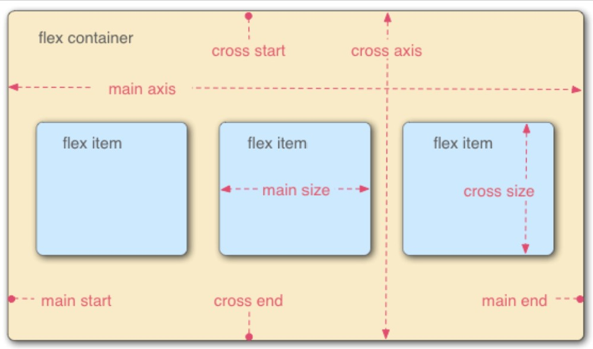
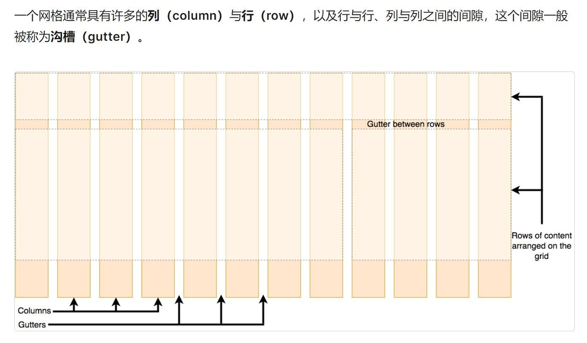

# css基础知识
## 层叠与继承
优先级：内联style样式>ID选择器>类选择器、属性选择器、伪类>元素、伪元素选择器
!important能够覆盖所有普通规则的层叠（最好不要）
* --background-color: white !important;
相互冲突的声明将按以下顺序适用，后一种声明将覆盖前一种声明：
* 用户代理样式表中的声明 (例如，浏览器的默认样式，在没有设置其他样式时使用)。
* 用户样式表中的常规声明 (由用户设置的自定义样式)。
* 作者样式表中的常规声明 (这些是我们 web 开发人员设置的样式)。
* 作者样式表中的!important声明I
* 用户样式表中的!important 声明
## CSS选择器
### 全局选择器
* \# {} 
 ```
 article *:first-child {} 选择article元素的第一子元素
 ```
### 类型、类、ID选择器
* h1 {}
* .class {}
* #id {}
### 属性选择器
#### 存否和值选择器
* 存否和值选择器允许基于一个元素自身是否存在（例如href）或者基于各式不同的按属性值的匹配，来选取元素
* [attr]   
* [attr=value]  
* [attr|=value]
* [attr~=value]   
```                                
  li[class] {
    font-size: 200%;
}

li[class="a"] {
    background-color: yellow;
}

li[class~="a"] {
    color: red;
}
```        
### 子字符串匹配选择器   
* [attr^=value]
* [attr$=value] 
* [attr*=value]    
  ```
li[class^="a"]----匹配了任何值开头为a的属性
li[class$="a"]----匹配了任何值结尾为a的属性
li[class*="a"]----匹配了任何值的字符串中出现了a的属性
    ```  
### 大小写敏感--“i”值
```
li[class^="a" i]
```
### 伪类和伪元素
伪类就是开头为“:”的关键字
伪元素 “::”开头的表现得是像往标记文本中加入全新的 HTML 元素一样
* a:hover {}
* p:first-chlid {}
* p:first-chlid::first-line {}
......
#### 用户行为伪类
* :link
* :visited
* :hover
* :focus
```
a:link,
a:visited {
    color: rebeccapurple;
    font-weight: bold;
}

a:hover {
    color:hotpink;
}
```
* article p::first-line {}
* ::before--与content一同使用，在文档中插入内容
```            
 .box::before {
    content: "This should show before the other content."
}
```
### 关系选择器
#### 后代关系选择器--"空格"
空格字符组合选择器
```
.box p {
    color: red;
}  
```
#### 子代关系选择器--">"
```
ul > li {
    border-top: 5px solid red;
}  
练习的时候使用“color”，会对所有li生效 存疑
```
#### 邻接兄弟选择器--"+"
```
h1 + p {
    font-weight: bold;
    background-color: #333;
    color: #fff;
    padding: .5em;
}  
```
#### 通用兄弟选择器--"~"
```
h1 ~ p {
    font-weight: bold;
    background-color: #333;
    color: #fff;
    padding: .5em;
}
```
## CSS盒模型
### 块级盒子和内联盒子
#### 块级盒子
* 块级盒子`block box`，块级盒子其实就是可以包含文本、块级、行内元素
* 盒子会在内联的方向上扩展并占据父容器在该方向上的所有可用空间，在绝大数情况下意味着盒子会和父容器一样宽
* 每个盒子都会换行
* width 和 height 属性可以用
* 内边距（padding）, 外边距（margin）和边框（border）会将其他元素从当前盒子周围“推开”
* 块级元素一般都是块级盒子
#### 内联盒子
* 内联盒子`inline box`，内联盒子只能包含文本和行内元素
* 盒子不会产生换行
 * width 和 height 属性不可用
*垂直方向的内边距、外边距以及边框会被应用但是不会把其他处于 inline 状态的盒子推开
* 水平方向的内边距、外边距以及边框会被应用且会把其他处于 inline 状态的盒子推开
* 行内元素默认都是内联盒子
```
-:|-:|
.box {                   .box{                 
  display: bolck;          display:inline;     
}                         }                     
  显示为块级盒子          显示为内联盒子
                         inline时width和height属性不可用        
```
### CSS中块级盒子组成部分
|  组成部分   | 含义                       |      大小控制 |
| :---------: | :------------------------- | ------------: |
| content box | 显示内容                   | width、height |
| padding box | 包围在内容区域外的空白区域 |   padding属性 |
| border box  | 包裹内容和内边距           |    border属性 |
| margin box  | 最外面的区域               |    margin属性 |

* 标准盒模型`box-sizing: content-box`，它的width就是content的width，盒子的的大小：content + padding + border，盒子大小以内容为先，自动扩展，子元素可以撑开父元素，大小随内容的变化而变化。
（margin影响的是盒子外部空间，不计入盒子大小）

替代(IE)盒模型
* 默认使用的是标准盒模型，可设置`box-sizing: border-box`来使用替代模型
```
.box {
    box-sizing: border-box;
}
```
* 替代盒模型大小：，父元素的盒模型确定之后，子元素就无法撑开父元素的盒模型，就像铁箱子，大小不能被内容改变。
* 盒模型在定义width宽度后，后面写padding和border是会改变盒子实际大小。如果需要保持固定大小，需要进行计算。
* 替代模型在定义width宽度后，不管怎么写padding和border宽度都固定在书写时的width。但是有可能导致内容被压缩，导致布局异常。
### 外边距、内边距和边框
#### 外边距 
* margin：盒子周围一圈看不到的空间，将其他元素从盒子旁边推开。值可正可负，负值时会与其他内容重叠。在计算可见部分后额外添加。
* margin-top; margin-right; margin-bottom; margin-left;
* 外边距折叠：若有两个外边距相接的元素，这些外边距将合并为一个外边距，即最大的单个外边距的大小

#### 边框
* border：在边距和填充框之间
* border-width；border-style；border-color。可设置单边也可设置多边
#### 内边距
* padding：边框和内容区域之间，必须为0或正值，将内容推离边框
* padding-top/right/bottom/left
### display: inline-block
* display: inline-block,`width`和`height`属性可用
* `padding`，`margin`，`border`会推开其他元素
* 不会跳转到新行
## 背景和边框
### background-image
* 会显示在background-color上层
* background-repeat：控制图像平铺
  * background-repeat: no-repeat;  不重复
  * background-repeat: repeat-x/y; 水平/垂直重复
  * background-repeat: repeat;     两个方向重复
* background-size: 调整图像大小
  * background-size: cover   不保留百分比
  * background-size: contain 保留百分比使图像留在框里
* background-position：背景图像定位（默认背景位置值是0，0）
  * 最常见，(x,y)
  * 可用关键字； 长度值；百分比或者混合使用
  * background-position: top center;
  * background-position: 20px 10%;
  * background-position: top 20px;
  * background-position: top 20px right 10px;
* 渐变背景
* 多个背景，background-image: url(img1), url(img2), url(img3);显示顺序1上3下
* background的简写
```
background: url("https://mdn.mozillademos.org/files/11983/starsolid.gif") #99f repeat-y fixed;
size只能紧跟着position，用“/”分割
```
* background-attachment 背景附加
#### border
* border-width/style/color 可单个使用可组合使用
* border-style
  * border-style: none;   无边框，优先值低，有其他重叠边框就会显示
  * border-style: hidden; 无边框，优先值高，有重叠边框也不显示
  * border-style: solid;  实线
  * border-style: double;  双实线
  * border-style: dashed;  方虚线
  * border-style: dotted;   圆虚线
  * border-style: groove;  外深内浅雕刻效果
  * border-style: ridge;   外浅内深雕刻效果
  * border-style: inset;   陷入效果
  * border-style: outset;  突出效果
* border-radius: 圆角，传递两个值时(垂直半径，水平半径)，也可只传递一个值
## 处理不同方向的文本
### 书写模式、块级布局和内联布局
* `writing-mode: horizontal`  块流从上至下，横向文本（默认）
* `writing-mode: vertical-rl` 块流从右向左，纵向文本
* `writing-mode: vertical-lr` 块流从左向右，纵向文本


### 逻辑属性和逻辑值
* 横向书写模式
  * 映射到width的属性被称作内联尺寸（inline-size），内联维度的尺寸
  * 映射height的属性被称为块级尺寸（block-size），块级维度的尺寸
### 逻辑外边距、边框和内边距属性
| 书写方式 |    horizontal     |        vertical         |
| :------: | :---------------: | :---------------------: |
|   属性   |       width       |       inline-size       |
|          |      height       |          flow           |
|          | border-top/bottom | border-block-start/end  |
|          | border-left/right | border-inline-stsrt/end |
## 溢出的内容
* overflow控制元素溢出
  * `overflow: visible`  默认值，会显示溢出内容
  * `overflow: hidden`   裁减掉溢出内容不显示
  * `overflow: scroll`   不管内容是否溢出，默认出现x，y轴两个滚动条
  * `overflow: auto`     只在溢出的时候出现滚动条
  * 可以用overflow属性指定 x 轴和 y 轴方向的滚动，同时使用两个值进行传递。如果指定了两个关键字，第一个对overflow-x生效而第二个对overflow-y生效。否则，overflow-x和overflow-y将会被设置成同样的值。例如，overflow: scroll hidden会把overflow-x设置成scroll，而overflow-y则为hidden
  ## css的值与单位
  ### 数字、长度和百分比
  
  
  * 百分比作为长度单位，值与父元素相关
  ### 颜色
  * RGB()
  ```
   background-color: rgb(18, 138, 125);
   ```
  * RGBA(),1为完全不透明，0为完全透明
  ```
   background-color: rgba(18, 138, 125, .5);
   ```
   * HSL()
     * 色调：0~360，表示色轮周围的角度
     * 饱和度：0~100%，0为无颜色（表示为灰色阴影），100%为全色饱和度
     * 亮度：0~100%，0表示没有光（显示为黑色），100%为全亮（白色）
     ```
     background-color: hsl(188, 97%, 28%);
     ```
   * HSLA()
   ```
   background-color: hsla(188, 97%, 28%, 0.3);
   ```
### 图片
```
background-image: url(star.png);
background-image: linear-gradient(90deg, rgba(119,0,255,1) 39%, rgba(0,212,255,1) 100%)
```
### 位置
* position：2D坐标定位元素，默认位置是左上方（0，0），第一个值x方向，第二个值y方向。只指定一个值时，另一个轴默认为center
### 字符串和标识符
* 字符串被“""”包围`content: "This is a string"`
* 标识符如color的值red、blue等
### 函数
* 函数是一段可重用的代码，可以多次运行，以完成重复的任务
* rgb(), hsl(), url()等
## 在css中调整大小
* 设置具体尺寸
```
box {
  border: 5px solid darkblue;
  width: 300px;
  margin: 10%;
  padding: 10%;
}
```
* min-height:盒子会一直保持大于这个最小高度，有比这个盒子在最小高度状态下所能容纳的更多内容，那么盒子就会变大，处理变化容量时很有用
* max-height:常用在没有足够空间以原有宽度展示图像时，让图像缩小，同时确保它们不会比这一宽度大
## 图像、媒体和表单元素
### 替换元素
* css不能影响这些元素的内部布局，仅影响它们在页面上对于其他元素中的位置，图像和视频就是替换元素
### 调整图像大小
* max-height;
* object-fit: cover;    图像会保持比例充满盒子，一部分可能会被裁掉
* object-fit: contain;  图像会缩放进盒子，若与盒子比例不同会留空
object-fit: fill;       图像会改变比例充满盒子
### 布局中的替换元素
* 
## 样式化表格
* table-layout: fixed
```
table {
  table-layout: fixed;
  width: 100%;
}

thead th:nth-child(1) {
  width: 30%;
}

thead th:nth-child(2) {
  width: 20%;
}

thead th:nth-child(3) {
  width: 15%;
}

thead th:nth-child(4) {
  width: 35%;
}
根据列标题的宽度来规定列的宽度
```
* border-collapse: collapse  边框合为一条
## 基础文本和字体样式
### 字体
* color `color: red;`
* font-family `font-family: arial;`
* font-size `font-size: 10px;`
* 网页安全字体

* 默认字体

* 字体栈：可以给浏览器提供多种字体可以选择，浏览器从列表的第一个开始查看这个字体是否可用，一般在字体栈的最后提供一个合适的通用的字体名称
```
p {
  font-family: "Trebuchet MS", Verdana, sans-serif;
}
```
* 字体样式，字体粗细，文本转换和文本装饰
  * font-style
    * font-style: normal;  将文本设置为普通字体 (将存在的斜体关闭)
    * font-style: italic;  文本设置为斜体版本(若不可用，自动oblique)
    * font-style: oblique; 将文本设置为斜体字体的模拟版本，也就是将普通文本倾斜的样式应用到文本中。
  * font-weight
    * font-weight: normal;    普通
    * font-weight: bold;      加粗
    * font-weight: lighter;   比父元素更细
    * font-weight: bolder;    比父元素更粗
 * text-transform
    * text-transform: none;        禁止任何转型
    * text-transform: uppercase;   将所有文本转成大写
    * text-transform: lowercase;   将所有文本转成小写
    * text-transform: capitalize;  所有单词首字母大写
    * text-transform: full-width;  将所有字形转换成全角，即固定宽度的正方形，类似于等宽字体，允许拉丁字符和亚洲语言字形（如中文，日文，韩文）对齐
  * text-decoration
    * text-decoration: none;           取消已经存在的文本装饰
    * text-decoration: underline;      文本下划线
    * text-decoration: overline;       文本上划线
    * text-decoration: line-through;   穿过文本的线
    * text-decoration可以一次接受多个值，如`text-decoration: underline overline;`
    * text-decoration 是一个缩写形式，它由 `text-decoration-line`, `text-decoration-style`和 `text-decoration-color`构成
    ```
    text-decoration: line-through red wavy;
    ```
  * 文本阴影`text-shadow`
  ```
  text-shadow: 4px 4px 5px red;
  阴影与原始文本的水平偏移、垂直偏移、模糊半径、颜色
  ```
  ```
  text-shadow: -1px -1px 1px #aaa,
             0px 4px 1px rgba(0,0,0,0.5),
             4px 4px 5px rgba(0,0,0,0.7),
             0px 0px 7px rgba(0,0,0,0.4);
  ```
### 文本布局
* 文本对齐
  *text-align: left;    
  *text-align: right;
  *text-align: center;
  *text-align: justfy     使文本展开，改变单词之间的差距，使所有文本行的宽度相同，谨慎使用
* 行高`line-height`
* 字母与单词间距
  * 字母间距`letter-spacing`
  * 单词间距`word-spacing`
* font简写
  * 如果使用font的简写形式，在所有这些属性中，只有`font-size`和`font-family`是一定要指定的。
    `font-size`和`line-height`属性之间必须放一个正斜杠。
   ```
     font: italic normal bold normal 3em/1.5 Helvetica, Arial, sans-serif;
   ```
## 样式化列表
### 处理列表间距
* line-height
     ```
     line-height: 20px;
     line-height: 1.5;  (该元素字体大小的1.5)
     ```
### 列表特定样式
* list-style-type: 设置列表的项目符号
* list-style-position: 设置项目符号位置，默认`outside`，列表项之外
* list-style-image: 自定义项目符号图片 `list-style-image: url(example.img);`，但控制图片位置、大小难，最好用`background`
     ```
     ul {
       padding-left: 2rem;             ul，li设置相同的padding-left，让整个列表项仍然排列在列表中，
       list-style-type: none;          但是列表项产生了一些用于背景图像的填充取消项目符号，取消项目符号，
     }                                 用backfround代替

     ul li {
       padding-left: 2rem;
       background-image: url(star.svg);
       background-position: 0 0;            图片位置是每个列表项的左上（0，0）处
       background-size: 1.6rem 1.6rem;      图片大小，比为列表项目符号设置的20px稍小，效果较好
       background-repeat: no-repeat;        背景不复制
      }
      ```
      ```
      ul {                                       可简写为：
        list-style-type: square;                ul {
        list-style-image: url(example.png);      list-style: square url(example.png) inside;
        list-style-position: inside;            }
      }                                
     ```
### 管理列表计数
* `start` 从特定值开始计数
  `<ol start="4"><li>这是从4开始的列表 4567···</li></ol>`
* `reversed`  从特定值开始，倒数计数
   `<ol reversed="4"><li>这是从4开始倒数的列表 4321</li></ol>`
* `value`  设置列表项指定数值
   ```
      <ol>
        <li value="2">这是一个2,4,6,8列表</li>
        <li value="4">这是一个2,4,6,8列表</li>
        <li value="6">这是一个2,4,6,8列表</li>
        <li value="8">这是一个2,4,6,8列表</li>
      </ol>
   ```
## 样式化链接
### 链接样式
* a: link：向未被访问的链接添加样式，表⽰链接在正常情况下（即页⾯刚加载完成时）显⽰的颜⾊。
* a: visited：向已被访问的链接添加样式，表⽰链接被点击后显⽰的颜⾊。
* a: hover: 当⿏标悬浮在元素上⽅时，向元素添加样式，表⽰⿏标悬停时显⽰的颜⾊。
* a: focus：向拥有键盘输⼊焦点的元素添加样式，表⽰元素获得光标焦点时使⽤的颜⾊，主要⽤于⽂本框输⼊⽂字时使⽤(鼠标松开时显示的颜色)
* a:active：向被激活的元素添加样式，表⽰当所指元素处于激活状态（⿏标在元素上按下还没有松开）时所显⽰的颜⾊
### 在链接中包含按钮
```
a[href*="http"] {                                    选中拥有href属性且属性值包含http的<a元素>（外部链接）
  background: url('example.png') no-repeat 100% 0;   选择要插入的自定义图片，不重复，在右边距离上方0px处
  background-size: 16px 16px;                        图片大小16*16px
  padding-right: 19px;                               右边留出19px空间放置图片
}
```
### 样式化链接为按钮
```
ul {
  padding: 0;
  width: 100%;
}

li {
  display: inline;               把li变成内联元素，这样就会显示在一行
}

a {
  outline: none;                 
  text-decoration: none;         把超链接的外部轮廓和下划线关掉
  display: inline-block;         a默认是内联元素，设置为inline-block可以控制它的大小又不换行
  width: 19.5%;                  这有5个按钮，要保证大小一样，设置为这个大小的宽度和margin
  margin-right: 0.625%;
  text-align: center;            内容水平居中
  line-height: 3;                内容垂直居中
  color: black;
}

li:last-child a {                上面设置的值让5个按钮的width和margin加起来超过100%了，为了不溢出，清除
  margin-right: 0;                最后一个按钮的margin
}

a:link, a:visited, a:focus {
  background: yellow;
}
```
### Web字体
```
@font-face {
  font-family: "myFont";
  src: url("myFont.ttf");
}

html {
  font-family: "myFont", "Bitstream Vera Serif", serif;
}
```
```
@font-face {
  font-family: 'ciclefina';
  src: url('fonts/cicle_fina-webfont.eot');
  src: url('fonts/cicle_fina-webfont.eot?#iefix') format('embedded-opentype'),
         url('fonts/cicle_fina-webfont.woff2') format('woff2'),
         url('fonts/cicle_fina-webfont.woff') format('woff'),
         url('fonts/cicle_fina-webfont.ttf') format('truetype'),
         url('fonts/cicle_fina-webfont.svg#ciclefina') format('svg');
  font-weight: normal;
  font-style: normal;
}
```
## 弹性盒子
### flex模型

* 是一种用于按行或按列布局元素的一维布局方法。元素可以膨胀以填充额外的空间，收缩以适应更小的空间
* 主轴（main axis）是沿着 flex 元素放置的方向延伸的轴（比如页面上的横向的行、纵向的列）。该轴的开始和结束被称为 main start 和 main end
* 交叉轴（cross axis）是垂直于 flex 元素放置方向的轴。该轴的开始和结束被称为 cross start 和 cross end
* 设置了``display: flex`的父元素被称之为flex容器（flex container）
* 在 flex 容器中表现为柔性的盒子的元素被称之为flex项（flex item）
### 设置主轴
* flex-direction
  * flex-direction: row;  默认值，行布局
  * flex-direction: column;  列布局
  * flex-direction: row-reverse;  从左向右行布局
  * flex-direction: column-reverse;  从下至上列布局
### 换行
* flex-wrap: wrap 给flex容器设置，当在布局中使用定宽或者定高的时候，任何溢出的元素将被移到下一行
### flex-flow缩写
* `flex-direction`和`flex-wrap`缩写为`flex-flow`
```
   flex-direction: row;
   flex-wrap: wrap;
        ||
   flex-flow: row wrap;
```
### flex的动态尺寸
```
section {
  display: flex;       给section的子元素article设置display，把它变成弹性盒子
  flex-wrap: wrap;    当元素内容超过高度会换行，避免发生溢出

}
article {
  flex: 1 200px;   每个 flex 项将首先给出 200px 的可用空间，然后，剩余的可用空间将根据分配的比例共享
}
 article:nth-of-type(3){   第三个article占两个单位的空间
  flex: 2;
} 
```
### flex:缩写与全写
* flex-grow/shrink/basis
### 水平和垂直对齐
* align-items
  * align-items: stretch;
  * align-items: center;
* justify-content
  * justify-content: flex-start;     flex项在主轴开始处
  * justify-content: flex-end;       结尾处
  * justify-content: center;         居中
  * justify-content: space-around;   沿主轴均匀分布，在任意一端都留有空间
  * justify-content: space-between;  同上，但不会留空间
# flex排序
```
button:first-child {         会把第一个button移到末尾
  order: 1;                  order默认值是 0 ，order越大越靠后，值相同时按源顺序显示，也可设置负值前移元素
}
```
## 网格
### 了解网格

* 是一个用于 web 的二维布局系统。利用网格，你可以把内容按照行与列的格式进行排版。另外，网格还能非常轻松地实现一些复杂的布局
### 创建网格
* ```
    container {
      display: grid;
      grid-template-columns: 1fr 1fr 1fr;
    }
  ```
* 网格间隙
  * grid-gap
* 重复构建行/列
  * ```
      .container {
        display: grid;
        grid-template-columns: repeat(3, 2fr 1fr);       会构建4列：2fr 1fr 2fr 1fr
        grid-gap: 20px;
      }
    ```
* 显式网格与隐式网格
  * 显式网格是用grid-template-columns或grid-template-rows属性创建的，隐式网格则是当有内容被放到网格外时才会生成的。
  * 隐式网格中生成的行/列大小是参数默认是auto，大小会根据放入的内容自动调整。也可以使用grid-auto-rows和grid-auto-columns属性手动设定隐式网格的大小。
  * 隐式网格就是为了放显式网格放不下的元素，浏览器根据已经定义的显式网格自动生成的网格部分。
    ```
      .container {
        display: grid;
        grid-template-columns: repeat(3, 1fr);
        grid-auto-rows: 100px;
        grid-gap: 20px;
      }
* minmax()函数
  ```
    .container {
      display: grid;                            如果所有网格内的内容均小于100px，那么看起来不会有变化，
      grid-template-columns: repeat(3, 1fr);    但如果在某一项中放入很长的内容或者图片，
      grid-auto-rows: minmax(100px, auto);      这个格子所在的行的高度变成能刚好容纳内容的高度了
      grid-gap: 20px;
    }
  ```
* 自动使用多列填充 
  ```
    .container {               会有一个包含了许多至少200px宽的列的网格，将容器填满。随着容器宽度的改变，
      display: grid;       网格会自动根据容器宽度进行调整，每一列的宽度总是大于200px，并且容器总会被列填满。
      grid-template-columns: repeat(auto-fill, minmax(200px, 1fr));
      grid-auto-rows: minmax(100px, auto);
      grid-gap: 20px;
    }
  ```
### 基于线的元素放置
* grid-column-start; grid-column-end = grid-column
* grid-row-start; grid-row-end = grid-row
  ```
  article {
    grid-column: 2;
    grid-row: 2;
  }  
  
  aside {
    grid-column: 1;
    grid-row: 2;
  }  
  
  footer {
    grid-column: 1 / 3;
    grid-row: 3;
  }
  ```
### grid-template-areas放置元素
```
   .container {
      display: grid;
      grid-template-areas: "header header"
                           "sidebar content"
                           "footer footer";
      grid-template-columns: 1fr 3fr;
      grid-gap: 20px;
    }
    
    header {
      grid-area: header;
    }
    
    article {
      grid-area: content;
    }
    
    aside {
      grid-area: sidebar;
    }
    
    footer {
      grid-area: footer;
    }
```
* 对于某个横跨多个格子的元素，重复写上那个元素grid-area属性定义的区域名字
* 所有名字只能出现在一个连续的区域，不能在不同的位置出现
* 一个连续的区域必须是一个矩形
* 使用"."符号，让一个格子留空
### 浮动
### 定位
* 静态定位
  * position: static;
  * ```
      .positioned {             静态定位是每个元素获取的默认值
        position: static;       positioned背景变黄，其他无变化
        background: yellow;
      } 
* 相对定位
  * position: relative; 
  * ```
      .positioned {             与静态定位非常相似，占据在正常的文档流中
        position: static;       positioned下移30px，右移30px
        top: 30px;
        left: 3opx;
      } 
    ```
* 绝对定位
  * position: absolute;         绝对定位的元素不再存在于正常文档布局流中，它坐在它自己的层独立于一切
  * 绝对定位固定元素是相对于 <html> 元素或其最近的定位祖先，一般设置父元素position: relative;
* z-index
  * z-index: 1;
  * z-index值影响定位元素位于该轴上的位置。正值将它们移动到堆栈上方负值将它们向下移动到堆栈中。默认情况下，定位的元素都具有z-index为 auto，实际上为0。
* 固定定位
  * position: fixed;
  * 固定定位固定元素是相对于浏览器视口本身。可以用来创建固定的有用的UI项目,如持久导航菜单
  ```
    h1 {
      position: fixed;          不管怎么滚动，h1标题会保持固定
      top: 0;
      width: 500px;
      margin: 0 auto;
      background: white;
      padding: 10px;
    }
  ```
* position- sticky  
  * 相对位置和固定位置的混合体，被定位的元素会表现得像相对定位一样，直到它滚动到某个阈值点后它就变得固定了。例如，它可用于使导航栏随页面滚动直到特定点，然后粘贴在页面顶部。
    ```
      .positioned {
        position: sticky;       
        top: 30px;
        left: 30px;
      }
    ```
  * position: sticky的另一种常用用法：创建一个滚动索引页面，在此页面上，不同的标题会停留在页面顶部。
## 多列布局
* ```
    .container {
      column-count: 3;                  把container分成三列,宽度由浏览器决定
      // column-width: 200px;           尽可能多的创建200px宽的列，剩余的空间之后会被现有的列平分。 
                                        可能无法期望得到你指定宽度，除非容器的宽度刚好可以200px除尽        
      column-gap: 20px;                 列间间隙20px
      column-rule: 4px dotted rgb(79, 185, 227);       列与列之间加了4px圆点虚线
    }
  ```
 * 列与内容折断
   ```
    .container {
      column-width: 250px;
      column-gap: 20px;
    }  
  
    .card {
      break-inside: avoid;
      page-break-inside: avoid;           内容不会被分开了
      background-color: rgb(207, 232, 220);
      border: 2px solid rgb(79, 185, 227);
      padding: 10px;
      margin: 0 0 1em 0;
    }
   ```
 ## 媒体查询
* 语法组成
  * media-type媒体类型：告诉浏览器这段代码是用在什么类型的媒体上的（打印机或者屏幕？）
  * media-feature-rule媒体特征规则：每种媒体类型都具有各自不同的特性，根据其不同的媒体特性设置不同的展示风格
  * CSS 规则
    ```
      @media media-type and (media-feature-rule) {
        /* CSS rules go here */
      }
    ```  
* 可以指定的媒体类型有
  * all
  * print
  * screen
  * speech
* 常用的媒体特性
  * 宽和高
    * width
    ```
       @media screen and (width: 600px) {
           body {                                   body的文字在视口为600px宽时显示为红色
             color: red;
           }
       }
    ```
    * min-width
    ```
       @media screen and (min-width: 400px) {
         body {                                    body的文字在视口宽度大于400px时显示为黄色
           color: yellow;
         }
       }
    ```
    * max-width
    ```
       @media screen and (max-width: 400px) {
         body {
           color: blue;                           body的文字在视口宽度小于400px宽时显示为蓝色
         }
       }
    ```
  * 朝向-orientation: portrait mode（竖放）/ landscape mode（横放）
    ```
      @media (orientation: landscape) {
        body {                                   body的文字在屏幕竖放时时显示为紫色
          color: purple;
        }  
      }
    ```
  * 悬浮-hover
    ```
      @media (hover: hover) {
        body {                                  body的文字在鼠标悬停时显示为绿色
          color: green;
        }
      }
    ```
* 复杂媒体查询--或/与/非逻辑
  * 或：想要查询时其中的任何一个都可以匹配，使用“，”分开这些查询
    ```
      @media screen and (min-width: 400px), screen and (orientation: landscape) {
        body {                                  body的文字会在视口至少为 400 像素宽的时候或者设备处于横放状态的时候变为蓝色
          color: blue;
        }
      }
    ```
  * 与：and
    ```
      @media screen and (min-width: 400px) and (orientation: landscape) {
        body {                                  body的文字会在视口至少为400px宽，且设备横放时变为蓝色。
          color: blue;
        }
      }
    ```
  * 非：not,会让整个媒体查询失效，直接反转了整个媒体查询的含义
    ```
      @media not all and (orientation: landscape) {
        body {                                   body的文字只会在朝向为竖着的时候变成蓝色
          color: blue;
        }
      }
