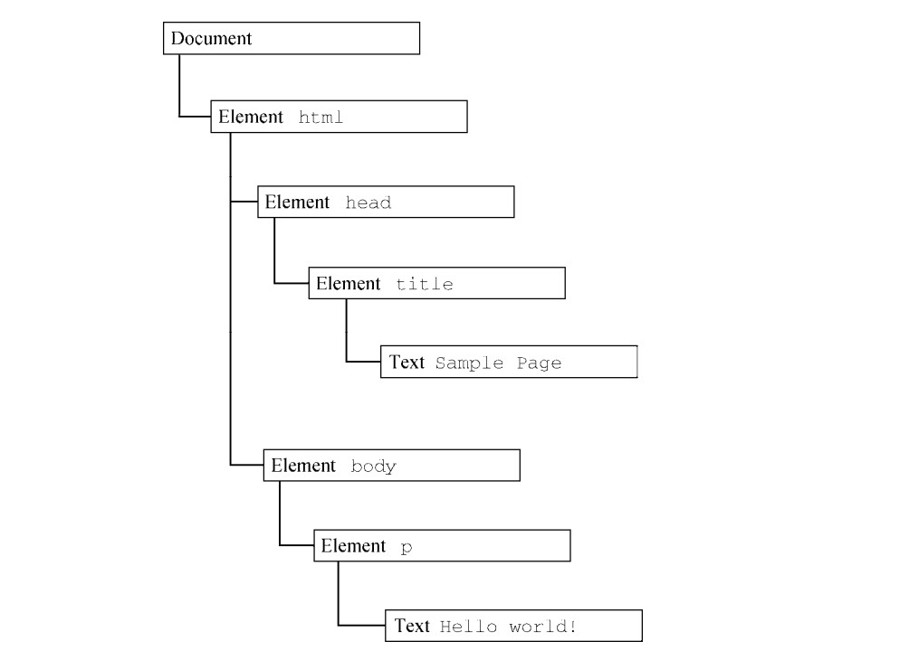

# JS 基础
## JS 基础了解
### 什么是 JavaScript
* 关于 HTML、CSS、JS
  * HTML：标记语言，用来结构化我们的网页内容并赋予内容含义，例如定义段落、标题和数据表，或在页面中嵌入图片和视频
  * CSS：样式规则语言，可将样式应用于 HTML 内容，例如设置背景颜色和字体，在多个列中布局内容
  * JavaScript：脚本语言，可以用来创建动态更新的内容，控制多媒体，制作图像动画，还有很多
* 使用 js
  * 内部 is
    ```
      <script>
         // 在此编写 JS 代码
      </script>
    ```
  * 外部 js
    ```
    <script src="script.js" async></script>
    ```
* js 调用策略 async 和 defer
  * 如果脚本无需等待页面解析，且无依赖独立运行，那么应使用 async
  * 如果脚本需要等待页面解析，且依赖于其它脚本，调用这些脚本时应使用 defer，将关联的脚本按所需顺序置于HTML中
* JS中区分大小写，使用的是Unicode字符集
* 语句后以“;”结尾
* 注释：`// 单行注释`，`/* 多行注释 */`
## 语法和数据类型
### 声明
* const：声明一个块作用域的只读常量
* let：声明一个块作用域的局部变量，可选初始化一个值
* var：声明一个变量，可选初始化一个值
### 变量
* 关于变量
  * 变量就是用来存放数值的容器，独特之处在于它存放的数值是可以改变的，但它并不是数值本身,变量的名字又叫标识符
* 声明变量：`let/var 变量名;`
* 用var/let语句声明的变量，未赋值前，值为undefined
* 初始化变量: 可以先声明再初始化赋值，也可以声明的时候就初始化
  ```
    let myName = "aaa";
    let myAge = 11;
  ```
* 更新变量：再次赋予不同的值
  ```
    let myAge = 20;
    myAge = 30;
  ```
* 变量的作用域
  * 在函数之外声明的变量，叫做全局变量，它可被当前文档中的任何其他代码所访问
  * 在函数内部声明的变量，叫做局部变量，它只能在当前函数的内部访问
* 全局变量
  * 全局变量是全局对象的属性，在网页中全局对象是window，可以用如 window. variable的语法来设置和访问全局变量，可以通过指定window或frame的名字，在当前window或frame访问另一个window或 rame 中声明的变量
* 变量提升
  * 可以先使用变量稍后再声明变量，这一概念称为变量提升；JS变量感觉上是被“提升”或移到了函数或语句的最前面。但提升后的变量将返回undefined值。因此在使用或引用某个变量之后进行声明和初始化操作，这个被提升的变量仍将返回undefined值
  * 由于存在变量提升，一个函数中所有的var语句都应尽可能放在接近函数顶部的地方
* 变量命名规则
  * 变量名不要以下划线开头—— 以下划线开头的被某些JS设计为特殊的含义，因此可能让人迷惑
  * 变量名不要以数字开头
  * "小写驼峰命名法"：小写整个命名的第一个字母然后大写剩下单词的首字符
  * 变量名直观，描述所包含的数据。不要只使用单一的字母/数字或者长句
  * 变量名大小写敏感——因此 myage 与 myAge 是不同的变量
  * 避免使用 JS 的保留字给变量命名，如 var,function,let、for 等
* 常量 (Constants)
  * 关键字const创建一个只读常量
  * 常量标识符的命名规则和变量相同
  * 常量不可以通过重新赋值改变其值，也不可以在代码运行时重新声明。它必须被初始化为某个值
  * 常量的作用域规则与 let 块级作用域变量相同。若省略const关键字，则该标识符将被视为变量
  * 在同一作用域中，不能使用与变量名或函数名相同的名字来命名常量
### 数据结构和类型
* 数据类型
  * Boolean：布尔值，true 或 false，用于测试条件是否成立，如`let iAmAlive = true;`
  * null：一个表明null值得特殊关键字
  * undefined：与null一样的特殊关键字，表示未赋值时的属性
  * Number：整数、浮点数都可以，不需要引号引起来如`let myAge = 11;`
  * BigInt：任意精度的整数，可以安全存储和操作大整数，甚至超过数字的安全整数限制
  * Symbol：ES6中新加，一种实例是唯一且不可改变的数据类型
  * String：字符串，需要引号如`let myString = "how are you?";`
  * Array：数组，是单个对象，包含许多值，用“[]”括起来，用“,”分割
    ```
      let myNameArray = ['aa', 'bb','cc'];
      let myAgeArray = [10, 20, 30];
    ```
  * Object：对象，是现实生活中的模型的一种代码结构，如一个代表停车场的对象并，包含停车场的宽度和长度信息
    ```
      let dog = { name : 'Spot', breed : 'Dalmatian' };
    ```
* 数据类型的转换
  * JS 是一种“动态类型语言”，不需要指定变量将包含什么数据类型（例如 number 或 string），例如声明一个变量并给它一个带引号的值，浏览器就会知道它是一个字符串
  * 数字转换为字符串: `+`
    ``` 
      x = "The answer is " + 42 // "The answer is 42"
      y = 42 + " is the answer" // "42 is the answer"
      
      "37" - 7 // 30 减号不会被把数字变成字符串，数学运算了
      "37" + 7 // "377"
    ```
  * 字符串转换为数字
    * parseInt()：只能返回整数，会丢失小数部分，最好总是带上进制 (radix) 参数，这个参数用于指定使用哪一种进制。
    * parseFloat()
    * 使用一元加法运算符
      ```
      "1.1" + "1.1" = "1.11.1"
      (+"1.1") + (+"1.1") = 2.2
* 字面量（Literals）
  * 字面量是由语法表达式定义的常量，一般除去表达式，给变量赋值时，等号右边都可以认为是字面量
  * 数组字面量 (Array literals)
    * 一个封闭在方括号对([])中的包含有零个或多个表达式的列表，其中每个表达式代表数组的一个元素。当使用数组字面值创建一个数组时，该数组将会以指定的值作为其元素进行初始化，而其长度被设定为元素的个数
    * 若在全局脚本里用字面值创建数组，JS语言将会在每次对包含该数组字面值的表达式求值时解释该数组。另一方面，在函数中使用的数组，将在每次调用函数时都会被创建一次
    * 数组字面值同时也是数组对象
    * 数组字面值中的多余逗号：在同一行中连写两个逗号（,），数组中就会产生一个没有被指定的元素，其初始值是undefined;在数组尾部添加了一个逗号，将会被忽略；在头部添加一个逗号也会产生一个未赋值元素
      ```
        var arr1 = [1,2,,4]      arr1.length = 4
        var arr2 = [,1,2,3]      arr2.length = 4
        var arr3 = [1,2,3,]       arr3.length = 3
      ```
  * 布尔字面量 (Boolean literals)
    * 布尔类型有两种字面量：true和false。
    * 不要混淆作为布尔对象的真和假与布尔类型的原始值true和false。布尔对象是原始布尔数据类型的一个包装器
  * 数字字面量
    * 数字字面量包括多种基数的整数字面量和十进制的浮点数字面量
    * 语言标准要求数字字面量必须是无符号的，但像-123.4这样的代码片段还是没有问题的，会被解释为一元操作符-应用于数字字面量123.4
  * 整数字面量
    * 整数可以用十进制（基数为 10）、十六进制（基数为 16）、八进制（基数为 8）以及二进制（基数为 2）表示
    * 十进制整数字面量由一串数字序列组成，且没有前缀 0
    * 八进制的整数以 0（或 0O、0o）开头，只能包括数字 0-7，严格模式下，八进制整数字面量必须以 0o 或 0O 开头，而不能以 0 开头
    * 十六进制整数以 0x（或 0X）开头，可以包含数字（0-9）和字母 a~f 或 A~F
    * 二进制整数以 0b（或 0B）开头，只能包含数字 0 和 1
      ```
        0, 117 and -345 (十进制)
        015, 0001 and -0o77 (八进制)
        0x1123, 0x00111 and -0xF1A7 (十六进制)
        0b11, 0b0011 and -0b11 (二进制)
      ```
  * 浮点数字面量
    * 组成部分
      * 一个十进制整数，可以带正负号（即前缀“+”或“ - ”）
      * 小数点（“.”）
      * 小数部分（由一串十进制数表示）
      * 指数部分: 指数部分“e”或“E”开头，后面跟着一个整数，可以有正负号。浮点数字面量至少有一位数字，而且必须带小数点或者“e”（大写“E”也可）
  * 对象字面量 (Object literals)
    * 封闭在花括号对 ({}) 中的一个对象的零个或多个"属性名 - 值"对的（元素）列表
    * 不能在一条语句的开头就使用对象字面值，这将导致错误或产生超出预料的行为， 因为此时左花括号（{）会被认为是一个语句块的起始符
  * RegExp 字面值
    * 一个正则表达
      ```
        var re = /ab+c/;
      ```
  * 字符串字面量 (String literals)
    * 由双引号（"）对或单引号（'）括起来的零个或多个字符
### 字符串和字符串方法
* 字符串基础知识
  * 字符串需要用引号括起来，单引双引都可以，但不可在一个字符串中混用
    ```
      let string1 = "how are you";               对
      let string2 = 'nice to meat you';          对
      let string3 = "I'm fine";                  对
      let string4 = 'Tv show "Dark" is good';    对
      let string5 = 'I'm fine';                  错
      let string6 = 'hello";                     错
    ```
* 连接字符串
  * “+”操作符连接
    ```
      let one = "hello";
      let two = ",";
      let three = "how are you";
      let add = one + two + three;       add的值会是：hello，how are you
      let response = one + two + "I am fine*" + three    hello,I am fine*how are you
    ```
  * 数字与字符串
    * ```
      let date1 = 'front' + 242;
      let date2 = '11' +'22';        date1和date2的类型都是string
      ```
    * number()方法，将传递给它的任何类型值都转化为数字
    ```
      let myString = '123';
      let myNum = Number(myString);
    ```
    * toString()方法，将传递给它的任何类型值都转化为字符串
      ```
      let myString = '123';
      let myNum = Number(myString);
      ```
* 字符串方法
  * 获取字符串长度：length()
    ```
      let string = 'JavaScript';
      string.length;
    ```
  * 检索特定字符串字符：变量名末尾带上"[]",方括号内包含要返回的字符的编号
    ```
      检索第1个字母：          检索最后一个字母：
      string[0];              string[string.length*1];
    ```
  * 在字符串中查找子字符串并提取它
    * indexOf()：找出一个较小的字符串是否存在于一个较大的字符串
      ```
        string.indexOf('ava');     结果会是1，“ava”在“JavaScript”内从第3个字符开始，开始位置是2
        string.indexOf('avava');   结果会是*1，主字符串中不存在这个
      ```
    * slice()：知道字符串中子字符串开始和结束的位置，用slice()提取它
      ```
        string.slice(0, 3);        返回“Jav”，提取从第一个位置开始，直到但不包括最后一个位置
        string.slice(4);           返回“script”，没有包含第二个参数，返回的子字符串将是所有剩余字符
      ```
  * 转换大小写：toLowerase()/toUpperCase()
    ```
      let radData = 'How Are You';
      radData.toLowerCase();       返回“how are you”
      radData.toLowerCase();       返回“HOW ARE YOU”
    ```
### 数组
* 数组基础知识
  * 数组是一个包含了多个值的对象
  * 创建数组
    ```
       let food = ['fish', 'milk', 'noodles'];
       let sequence = [1, 1, 2, 3, 5, 8];
       let random = ['tree', 795, [0, 1, 2]];   多维数组
    ```
  * 访问和修改数组：与检索特定字符串字符的方法相同，变量名末尾带上"[]",方括号内包含要返回的数组值的编号
    ```
      food[0];            fish
      food[0] = 'egg';    fish变成了egg
      random[2][2];       2
    ```
  * 获取数组长度：length()
    ```
      food.length;       3
    ```
  * 添加/删除数组项
    * 在数组末尾操作：push()/pop()
      ```
         let food = ['fish', 'milk', 'noodles'];
         food.push('apple', 'egg');         food = ['fish', 'milk', 'noodles', 'apple', 'egg'];

         let list = [11, 22, 33, 44, 55, 66];
         let newLength = list.push(77,88);     list = [11, 22, 33, 44, 55, 66, 77, 88];
         newLength;                            list.length: 8;
        删除末尾元素与添加同理
      ```
    * 在数组开头操作：unshift()/shift()
      ```
         let food = ['fish', 'milk', 'noodles'];
         food.unshift('apple', 'egg');    food = ['apple', 'egg'， 'fish', 'milk', 'noodles'];

         let list = [11, 22, 33, 44, 55, 66];
         let removeItem = list.shift();
         list;                         list = [22, 33, 44, 55, 66];
         removeItem;                   removeItem: 11;
      ```
## 流程控制与错误处理
### 语句块
* 以`{}`界定
* 语句块内用`;``分割语句
### 条件判断语句
* if...else
  * 基本语法
    ```
      if (condition) {
        code to run if condition is true
      } else {
        run some other code instead
      }
    ```
  * 当需要两个以上的选择时，可以再加 `else...if`
  * if...else 语句可以在另一个 if...else 语句中嵌套使用
  * 比较运算符： 判断条件语句中的条件
    * ``===`/`!==`: 判断一个值是否严格等于/不等于另一个。
    * `<`/`>`: 判断一个值是否小于/大于另一个。
    * `<=`/`>=`: 判断一个值是否小于等于/大于等于另一个。
  * 逻辑运算符：`&&`/`||`/`!`
   * `&&`：“与”，当两个或更多表达式的每一个都返回true时，整个表达式才会返回true
   * `||`：当两个或更多表达式当中的任何一个返回 true 则整个表达式将会返回 true
   * `!`：对一个布尔值取反，非true返回false，非false返回true
* switch
  ```
   switch (expression) {
     case choice1:
       run this code
       break;
   
     case choice2:
       run this code instead
       break;
   
     // include as many cases as you like
   
     default:
       actually, just run this code
   }
     ```
  * 关键字switch, 后跟一组（），（）写表达式或值
  * 关键字case, 后跟一个选项的表达式/值，后面跟一个冒号
  * 如果选择与表达式匹配，则运行一些代码。
  * 一个break语句，分号结尾。如果先前的选择与表达式/值匹配，浏览器在此停止执行代码块，执行switch语句后的代码
  * 可以添加任意的case选项
  * 关键字default, 后跟一个选项的表达式/值，如果之前没有选项匹配，则运行default选项
  * default部分不是必须的，如果表达式不可能存在未知值，则可以省略它
* 三元运算符
  * `( condition ) ? run code1 : run code2 instead`条件为true时运行code1，为false时运行code2
### 异常处理语句
* 异常类型
  * JS可以抛出任意对象，但不是所有对象能产生相同的结果。抛出数值或者字母串作为错误信息十分常见，但用下列异常类型来创建目标更为高效：
    * ECMAScript exceptions
    * DOMException and DOMError
* throw语句
  * 用throw语句抛出一个异常，用 try...catch 语句捕获处理它
  * 当抛出异常时，也要有一个含有值的表达式抛出`throw expression;`
* try...catch 语句
  * 有一个try代码块，0个或1个的catch代码块，catch 代码块中的语句会在try代码块中抛出异常时执行（try块有异常未成功，执行catch块；try块无异常，不执行catch块）。finally 代码块会紧跟在try和catch代码块之后执行
  * catch 块
    * 处理所有可能在try块中产生的异常
  * finally块
    * finally块包含了在try和catch块完成后，下面接着 try...catch 的语句之前执行的语句。finally块无论是否抛出异常都会执行。如果抛出了一个异常，就算没有异常处理，finally块里的语句也会执行
    * 如果finally块返回一个值，该值会是整个try-catch-finally流程的返回值，不管在try和catch块中语句返回了什么
* 嵌套 try...catch 语句
  * 可以嵌套一个或多个try ... catch语句。如果一个内部try ... catch语句没有catch块，它需要有一个finally块，并且封闭的try ... catch语句的catch块被检查匹配
* 使用Error对象
  * 根据错误类型，也可以用'name'和'message'获取更精炼的信息：'name'提供了常规的错误类（如'DOMException'或'Error'），而'message'通常提供了一条从错误对象转换成字符串的简明信息
## 运算符与表达式
### 运算符
* 算数运算符
  * `+`加
  * `*`减
  * `*`乘
  * `/`除
  * `%`取余
  * `**`幂
  * 一元负值符`-` 返回操作数的负值
  * 一元正值符`+` 如果操作数在之前不是number，试图将其转换为number
  * 自增/自减运算符
    * `num++/num**`
    * 是为变量赋予一个新的更新值，不是对该值操作
    ```
      let num = 4;
      num++;
    ```
* 赋值运算符
  * `=`            将右边的值赋给左边    `x = y`
  * `+=`           加法赋值             `x = x + y;`
  * `*=`           减法赋值             `x = x - y;`          
  * `*=`           乘法赋值             `x = x * y;`
  * `/=`           除法赋值             `x = x / y;`
  * `%=`           求余赋值             `x = x % y;`
  * `**=`          求幂赋值             `x = x ** y;`
  * ` x<<= y`      左移位赋值           `x = x << y;`
  * `x >>= y`      右移位赋值           `x = x >> y;`
  * `x >>>= y`     无符号右移位赋值      `x = x >>> y;`
  * `x &= y`       按位与赋值           `x = x & y;`
  * `x ^= y`       按位异或赋值         `x = x ^ y;`
  * `x |= y`       按位或赋值           `x = x | y;`
* 解构赋值
  * 解构赋值语法是一种js表达式。通过解构赋值，可以将属性/值从对象/数组中取出，赋值给其他变量
  ```
    var a, b, rest;
    [a, b] = [10, 20];
    console.log(a);            // 10
    console.log(b);            // 20
    
    [a, b, ...rest] = [10, 20, 30, 40, 50];
    console.log(a);            // 10
    console.log(b);            // 20
    console.log(rest); // [30, 40, 50]
    
    ({ a, b } = { a: 10, b: 20 });
    console.log(a);           // 10
    console.log(b);           // 20
  ```
* 比较运算符  
  * `==`      等于 测试左右值操作数是否相同                 `5 == 2+3`
  * `!=`      不等于 测试左右值操作数是否不相同             `5 != 3+3`
  * `===`     严格等于 测试左右值操作数和类型是否相同        `5 === 2+3`
  * `！==`    严格不等于 测试左右值操作数或类型是否不相同         `5 !== '5'`
  * `<`       小于 测试左值是否小于右值 `5<2+3`
  * `>`       大于 测试左值是否大于右值 `5>2+3`
  * `<=`      小于等于 测试左值是否小于等于右值 `5<=2+3`
  * `>=`      大于等于 测试左值是否大于等于右值 `5>=2+3`
* 位运算符
  * 位运算符是在二进制表示上执行运算，但是返回结果是标准的JS数值
  * 按位与	     a & b	    在 a,b 的位表示中，每一个对应的位都为 1 则返回 1， 否则返回 0.
  * 按位或       a | b	    在 a,b 的位表示中，每一个对应的位，只要有一个为 1 则返回 1， 否则返回 0.
  * 按位异或   	va ^ b	    在 a,b 的位表示中，每一个对应的位，两个不相同则返回 1，相同则返回 0.
  * 按位非     	~ a	        反转被操作数的位。
  * 左移      	a << b	    将 a 的二进制串向左移动 b 位，右边移入 0.
  * 算术右移	  a >> b	    把 a 的二进制表示向右移动 b 位，丢弃被移出的所有位,左边空出的位是根据最高位是 0 和 1 来进行填充
  * 无符号右移  a >>> b 	  把 a 的二进制表示向右移动 b 位，丢弃被移出的所有位，并把左边空出的位都填充0
* 逻辑运算符
   * `&&`：“与”，当两个或更多表达式的每一个都返回true时，整个表达式才会返回true
   * `||`：当两个或更多表达式当中的任何一个返回 true 则整个表达式将会返回 true
   * `!`：对一个布尔值取反，非true返回false，非false返回true
* 关系运算符
  * 关系运算符对操作数进行比较，根据比较结果真或假，返回相应的布尔值
  * in： 如果所指定的属性确实存在于所指定的对象中，则会返回true
  * instanceof：如果所判别的对象确实是所指定的类型，则返回true
### 表达式
* 表达式是一组代码的集合，它返回一个值。每一个合法的表达式都能计算成某个值，但从概念上讲，有两种类型的表达式：有副作用的（比如赋值x =  7）和单纯计算求值的（3 + 4）
* JS中的表达式类型
  * 算数：得出一个数字，例如 3.14159（通常使用算数运算符）
  * 字符串：得出一个字符串，例如，"Fred" 或 "234"（通常使用字符串运算符）
  * 逻辑值：得出 true 或者 false（经常涉及到逻辑运算符）
  * 基本表达式: javascript 中基本的关键字和一般表达式
  * 左值表达式：分配给左值。
* 基本表达式
  * this：this关键字被用于指代当前的对象，通常，this指代的是方法中正在被调用的对象
  ```
    this["propertyName"]
    this.propertyName
  ```
  * 分组操作符:分组操作符（）控制了表达式中计算的优先级。可以改变先乘除后加减的顺序，转而先计算加法
* 左值表达式：左值可以作为赋值的目标
  * new：可以使用new operator创建一个自定义类型或者是预置类型的对象实例
  ```
    var objectName = new objectType([param1, param2, ..., paramN]);
  ```
  * super：super关键字可以用来调用一个对象父类的函数，它在用来调用一个类的父类的构造函数时非常有用
  ```
    super([arguments]); // calls the parent constructor. super.functionOnParent([arguments]);
  ```
* 扩展语句
  * 扩展语句符允许一个表达式在原地展开， 当需要多个参数 (比如函数调用时) 或者多个值 (比如字面量数组) 
  如：现有一个数组，想创建一个新数组，并将刚才那个数组作为新数组的一部分，用 array 的字面语法是不够的，但是用spread syntax 就没问题了：
  ```
    var parts = ['shoulder', 'knees'];
    var lyrics = ['head', ...parts, 'and', 'toes'];
    类似的，扩展语句也可以用在函数调用的时候：
    
    function f(x, y, z) { }
    var args = [0, 1, 2];
    f(...args);
  ```
## 数字和日期
### 数字
* JS中数字均为双精度浮点类型，除了能够表示浮点数，数字类型也还能表示三种符号值：+Infinity（正无穷）、-Infinity（负无穷）和 NaN (not-a-number，非数字)。新添加了BigInt，能够用于表示极大的数字。使用 BigInt 的时候有一些注意事项，如不能让BigInt和Number直接进行运算，也不能用Math对象去操作BigInt数字
* 数字对象
  * 内置的Number对象有一些有关数字的常量属性，如最大值、不是一个数字和无穷大的等，这些属性只能使用不能改变
  ```
    var biggestNum = Number.MAX_VALUE;
    var smallestNum = Number.MIN_VALUE;
    var infiniteNum = Number.POSITIVE_INFINITY;
    var negInfiniteNum = Number.NEGATIVE_INFINITY;
    var notANum = Number.NaN;
  ```
  * 数字的属性
    * 
    * Number.MAX_VALUE	        可表示的最大值
    * Number.MIN_VALUE	        可表示的最小值
    * Number.NaN	              特指“非数字”
    * Number.NEGATIVE_INFINITY	特指“负无穷”;在溢出时返回
    * Number.POSITIVE_INFINITY	特指“正无穷”;在溢出时返回
    * Number.EPSILON	          表示1和比最接近1且大于1的最小Number之间的差别
    * Number.MIN_SAFE_INTEGER	  JS 最小安全整数
    * Number.MAX_SAFE_INTEGER	  JS 最大安全整数
  * 数字的方法
    * Number.parseFloat()	      把字符串参数解析成浮点数，和全局方法parseFloat()作用一致
    * Number.parseInt()	        把字符串解析成特定基数对应的整型数字，和全局方法parseInt()作用一致 
    * Number.isFinite()	        判断传递的值是否为有限数字
    * Number.isInteger()	      判断传递的值是否为整数
    * Number.isNaN()	          判断传递的值是否为NaN，并且检查其类型是否为 Number
    * Number.isSafeInteger()	  判断传递的值是否为安全整数
  * 数字类型原型上的一些方法
    * toExponential()	          返回一个数字的指数形式的字符串，如：1.23e+2
    * toFixed()	                返回指定小数位数的表示形式，var a=123,b=a.toFixed(2)//b="123.00"
    * toPrecision()	            返回一个指定精度的数字
* 数学对象（Math）
  * Math的方法
    * abs()                   	         绝对值
    * sin(), cos(), tan()	               标准三角函数;参数为弧度
    * asin(), acos(), atan(), atan2()	   反三角函数; 返回值为弧度
    * sinh(), cosh(), tanh()	           双曲三角函数; 参数为弧度
    * asinh(), acosh(), atanh()	         反双曲三角函数;返回值为弧度
    * pow(), exp(), expm1(), log10(), log1p(), log2()  指数与对数函数
    * floor(), ceil()	                   返回小于等于参数的最大整数；返回大于等于参数的最小整数
    * min(), max()                       返回一个以逗号间隔的数字参数列表中的较小或较大值 (分别地)
    * 
    * random()	                         返回0到1之间的随机数
    * round(), fround(), trunc()       	 四舍五入和截断函数
    * sqrt(), cbrt(), hypot()	           平方根，立方根，所有参数平方和的平方根
    * sign()	                           数字的符号，说明数字是否为正、负、零。
    * clz32(),imul()	                   在32位2进制表示中，开头的0的数量
    * imul()                             将两个参数分别转换为32位整数，相乘后返回32位结果，类似 C 语言的32位整数相乘
    * 和其他对象不同，Math对象不能自己创建，只能使用内置的Math对象
* 日期对象
  * JS没有日期数据类型，但可以使用Date对象和其方法来处理日期和时间。Date 对象有大量的设置、获取和操作日期的方法，它并不含有任何属性
  * JS处理日期数据类似于Java，Date 对象的范围是相对距离UTC1970年1月1日的前后 100 000 000 天
  * 创建一个日期对象
  ```
    var dateObjectName = new Date([parameters]);
  ```
    * dateObjectName对象是所创建的Date对象的一个名字，它可以成为一个新的对象或者已存在的其他对象的一个属性
    * 不使用 new 关键字来调用 Date 对象将返回当前时间和日期的字符串
    * 前边的语法中的参数（parameters）可以是一下任何一种
      * 无参数 : 创建今天的日期和时间，例如： today = new Date();.
       * 一个符合以下格式的表示日期的字符串: "月 日，年 时：分:秒." 例如： var Xmas95 = new Date; ("December 25, 1995 13:30:00")。如果省略时、分、秒，其值将被设置为 0
       * 一个年，月，日的整型值的集合，例如： var Xmas95 = new Date(1995, 11, 25);
       * 一个年，月，日，时，分，秒的集合，例如： var Xmas95 = new Date(1995, 11, 25, 9, 30, 0);
  * Date 对象的方法
    * `set`         用于设置 Date 对象的日期和时间的值
    * `get`         用于获取 Date 对象的日期和时间的值
    * `to`          用于返回 Date 对象的字符串格式的值
    * `parse`和`UTC`用于解析 Date 字符串
    * 通过`get`和`set`方法，可以分别设置和获取秒，分，时，日，星期，月份，年。getDay 方法可以返回星期，但是没有相应的 setDay 方法用来设置星期，因为星期是自动设置的
    ```
      var Xmas95 = new Date("December 25, 1995");
      Xmas95.getMonth() 返回 11    Xmas95.getFullYear() 返回 1995
    ```
    ```
    展示今年剩下的天数：
      var today = new Date();
      var endYear = new Date(1995, 11, 31, 23, 59, 59, 999);         // 设置日和月，注意，月份是 0-11
      endYear.setFullYear(today.getFullYear());                      // 把年设置为今年
      var msPerDay = 24 * 60 * 60 * 1000;                            // 每天的毫秒数
      var daysLeft = (endYear.getTime() - today.getTime()) / msPerDay;
      var daysLeft = Math.round(daysLeft);                           //返回今年剩下的天数
    ```
    ```
    返回用数字时钟格式的时间：
      function JSClock() {                                // JSClock函数首先创建了一个叫做time的新的Date对象
        var time = new Date();                            // 因为没有参数，所以time代表了当前日期和时间
        var hour = time.getHours();                       // 调用了getHours方法把当前的时赋值给hour
        var minute = time.getMinutes();                   // 赋值分
        var second = time.getSeconds();                   // 赋值秒
        var temp = "" + ((hour > 12) ? hour - 12 : hour); // 在time的基础上创建了一个字符串，创建了一个变量temp
        if (hour == 0)
          temp = "12";
        temp += ((minute < 10) ? ":0" : ":") + minute;    // 拼接了minute的值到temp后
        temp += ((second < 10) ? ":0" : ":") + second;    // 拼接秒
        temp += (hour >= 12) ? " P.M." : " A.M.";         // hour>=12，在temp后拼接"P.M."，否则拼接"A.M."
        return temp;
      }
    ```
## 循环与迭代
### 代码循环 
* 循环需要的条件
  * 一个开始条件：被初始化为一个特定的值,是循环的起点
  * 一个结束条件：循环停止的标准,通常计数器达到一定值
  * 一个迭代器：通常在每个连续循环上递增少量的计数器，直到达到退出条件
* 循环有很多种类，但本质上都做的是同一件事：它们把一个动作重复了很多次（实际上重复的次数有可能为0）。各种循环机制提供了不同的方法去确定循环的开始和结束。不同情况下，某一种类型循环会比其它的循环用起来更简单
### 循环语句
* for
  * 会一直重复执行，直到指定的循环条件为false
  * 主要用于把某些代码循环若干次，通常针对循环次数确定的循环
  ```
    for ([initialExpression]; [condition]; [incrementExpression])
      statement
  ```
  ```
    for( var i = 1;i < 10;i++) {
      console.log("你好呀！");
    }
  ```  
* for...in
  * for...in语句可以把一个对象所有可枚举的属性依次循环出来
  ```
    for (variable in object) {
      statements
    }
  ```
* for...of
  * for...of语句在可迭代对象（包括Array、Map、Set、arguments 等）上创建了一个循环，对值的每一个独特属性调用一次迭代
  ```
    for (variable of object) {
      statement
    }
  ```
  ```
    let arr = [3, 5, 7];
    arr.foo = "hello";

    for (let i in arr) {                       // for...in 循环遍历的结果是数组元素的下标
       console.log(i);                         // 输出 "0", "1", "2", "foo"
    }                                    

    for (let i of arr) {                       // for...of 遍历的结果是元素的值
       console.log(i);                         // 输出 "3", "5", "7"
    }                                          // for...of 的输出没有出现 "hello"
  ```
* while
  * 只要指定的条件求值为true就会一直执行它的语句块
  ```
    while (condition)
      statement
  ```
  ```
    var i = 0;
    while (i < 100) {
      if (i === cats.length - 1) {
      info += 'and ' + cats[i] + '.';
      } else {
      info += cats[i] + ', ';
      }

      i++;
    }
  ```
  * 当条件满足时，进入循环；进入循环后，当条件不满足时，退出循环
  * 循环体中，一定要修改循环变量的值，保证循环的条件结果最终会变成假，否则会进入死循环（比如上面的i++/i--）
  * 循环变量的初始化一定放在while之前
  * while之后有一个（），表示要判断的条件，里面是一个条件表达式
  * 循环体可以使用{}，也可以不使用{}，如果不使用，循环体就只有一条语句  
* do...while
  * 一直重复直到指定的条件求值得到假值false
  ```
    do
      statement
    while(condition);
  ```
  ```
    var i = 0;
    do {
      if (i === cats.length - 1) {
      info += 'and ' + cats[i] + '.';
      } else {
      info += cats[i] + ', ';
      }

      i++;
    } while (i < cats.length);
  ```
  * 先运行一次，再检查条件表达式的值，若不满足则退出循环，do()语句至少执行一次
  * 循环变量初始化要放在do之前
  * 循环体中，一定要修改循环变量的值，否则会进入死循环
  * 循环体要使用{}，形成语句块
* label
  * label 语句
    * 一个label提供了一个可以在程序其他位置引用它的标识符。例如可以用label标识一个循环，然后使用break或者continue来指出程序是否该停止循环还是继续循环
  ```
    label :
      statement
  ```
    * label的值可以是任何的非保留字的JS标识符，statement可以是任意想要标识的语句或语句块
  ```
    未添加 Label：

      var num = 0;
      for (var i = 0 ; i < 10 ; i++) {     // i 循环
        for (var j = 0 ; j < 10 ; j++) {   // j 循环
          if( i == 5 && j == 5 ) {
             break;                        // i = 5，j = 5 时，会跳出 j 循环
          }                                // 但i循环会继续执行，等于跳出之后又继续执行更多次j循环
        num++;
        }
      } 
      alert(num);                          // 输出 95
    添加 Label 后：

      var num = 0;
      outPoint:
      for (var i = 0 ; i < 10 ; i++){
        for (var j = 0 ; j < 10 ; j++){
          if( i == 5 && j == 5 ){
            break outPoint;               // 在 i = 5，j = 5 时，跳出所有循环，
                                          // 返回到整个outPoint下方，继续执行
          }
          num++;
        }
      }
      alert(num);                         // 输出 55
    使用 continue 语句，可达到与未添加 label 相同的效果，但在这种有多层循环的情况下，循环的跳出进入流程更为明晰一些：
    
      var num = 0;
      outPoint:
      for(var i = 0; i < 10; i++) {
        for(var j = 0; j < 10; j++) {
          if(i == 5 && j == 5) {
            continue outPoint;
          }
          num++;
        }
      }
      alert(num);                      // 95
    从 alert(num) 的值可以看出，continue outPoint; 语句的作用是跳出当前循环，并跳转到outPoint下的for循环继续执行
  ```
* break
  * 使用break语句来终止循环、switch，或者是链接到label语句
  * 当使用不带label的break时， 它会立即终止当前所在的 while，do-while，for，或switch并把控制权交回这些结构后面的语句
  * 当使用带label的break时，它会终止指定的带标记（label）的语句
  ```
    break [label];
    被[]包裹的内容是可省略的,若省略，则终止当前所在的循环或switch；若不省略，则终止指定的 label 语句
  ```
  ```
  终止一个循环：循环数组里的元素，直到找到一个等于 theValue 的值
    
    for (i = 0; i < a.length; i++) {
      if (a[i] == theValue) {
        break;
      }
    }

  终止一个 label
    var x = 0;
    var z = 0
    labelCancelLoops: while (true) {
      console.log("外部循环: " + x);
      x += 1;
      z = 1;
      while (true) {
        console.log("内部循环: " + z);
        z += 1;
        if (z === 10 && x === 10) {
          break labelCancelLoops;
        } else if (z === 10) {
          break;
        }
      }
    }
  ```
* continue
  * 用来跳过当前循环，执行下一个循环
  * 当使用不带label的continue时，终止当前 while，do-while，或者 for 语句到结尾的这次的循环并且继续执行下一次循环
  * 当使用带label的continue时，它会应用被 label 标识的循环语句
## 函数
### 定义函数
* 定义函数有三种方式，函数声明，函数表达式，构造函数
  * 函数声明
    一个函数定义（也称为函数声明，或函数语句）包含
    * 函数的名称
    * 函数参数列表，包围在括号中并由逗号分隔
    * 定义函数的 JS 语句，用大括号{}括起来。
    ```
      function square(number) {             函数：square
        return number * number;             参数：number
      }                                     语句：参数自乘后返回
    ```
  * 函数表达式
    函数被当做值来使用的时候，就是一个函数表达式
    ```
      const square = function(number) { return number * number; };
      
      const factorial = function fac(n) {return n<2 ? 1 : n*fac(n-1)};
      函数表达式需要在函数体末尾加“;”，表示赋值语句结束
    ```
  * Function()构造函数
    ```
      var myFunction = new Function("a", "b", "return a * b") ;
      var x = myFunction(4, 3);                
    ```
  * 函数声明与函数表达式的不同
    * 函数声明必须始终带有一个标识符（Identifier），也就是函数名，而函数表达式则可以省略
    * 函数声明可以被提升，但是函数表达式不能被提升。所以在任何位置定义函数声明，都可以被使用；如果是函数表达式，只能在函数表达式声明之后调用它，如果在之前调用会报错
    * 函数声明不是一个完整的语句，所以不能出现在if-else等语句块中，这时应使用函数表达式
### 调用函数
* 通过`函数名()`调用，匿名函数可在函数体尾部通过`()`调用
  ```
  square(5);
  通过提供参数 5 来调用函数。函数执行完它的语句会返回值 25
  ```
* 函数可以被递归，即函数可以调用其本身
  ```
    function factorial(n){
      if ((n == 0) || (n == 1))
        return 1;
      else
        return (n * factorial(n - 1));
      }

      var a, b, c, d, e;

      a = factorial(1);   // 1 赋值给 a
      b = factorial(2);   // 2 赋值给 b
      c = factorial(3);   // 6 赋值给 c
      d = factorial(4);   // 24 赋值给 d
      e = factorial(5);   // 120 赋值给 e
### 函数作用域
* 函数作用域和冲突
  * 所有函数的最外层被称为全局作用域，在全局作用域内定义的值可以在任意地方访问
  * 函数内定义的变量和值都在它自己的单独的范围内，只能在函数内部被访问，外部不可访问，但内部函数可以访问全局作用域的值
  ```
    var x = 1;
    function a() {
      var y = x+ 2;
      console.log(y);
    }
    a();           // 打印出3
    var z = y +3;  // y is not defined
  ```
  * 在函数内部，两个函数可以有相同的变量名
  ```
    function a() {
      var x = 1;
      x = x + 2;
    }
    function b() {
      var x = 2;
      x = x + 2;
    }
  ```
  * 外部函数与内部函数变量名相同时，内部函数会屏蔽外部函数变量
  ```
    function a() {
      var x = 2;
      function b() {
        var x = 4;
         console.log('inner' + x);     // inner4
      }
      b();
      console.log('outer' + x);       // outer2
    }
    a();
   
  ```
### 闭包
* 闭包指的是那些引用了另一个函数作用域中变量的函数，通常是在嵌套函数中实现的
### 使用 arguments 对象
* 函数的实际参数会被保存在一个类似数组的arguments对象中。在函数内，你可以用`arguments[i]`找出传入的参数，i是参数的序数编号，从0开始
* 使用arguments对象可以处理比声明的更多的参数来调用函数。在事先不知道会需要将多少参数传递给函数时十分有用，可以用arguments.length来获得实际传递给函数的参数的数量，然后用arguments对象来取得每个参数
* arguments变量只是 “类数组对象”，并不是一个真正的数组。称其为类数组对象是说它有一个索引编号和length属性。尽管如此，它并不拥有全部的 Array对象的操作方法
### 函数参数
* ES6新增参数：默认参数，剩余参数
  * 默认参数：JS中函数参数的默认值是undefined。然而，在某些情况下设置不同的默认值是有用的，这时默认参数可以提供帮助
    ```
      function multiply(a, b = 1) {
        return a*b;
      }
    ```
  * 剩余参数：允许将不确定数量的参数表示为数组
    ```
      function multiply(multiplier, ...theArgs) {
        return theArgs.map(x => multiplier * x);
      }

      var arr = multiply(2, 1, 2, 3);
      console.log(arr);                // [2, 4, 6]
### 箭头函数
* ES6 新增,使用胖箭头（=>）语法定义函数表达式的能力，很大程度上，箭头函数实例化的函数对象与正式的函数表达式创建的函数对象行为是相同的。任何可以使用函数表达式的地方，都可以使用箭头函数
  ```
    普通函数                               箭头函数
    let sum = function(a, b) {            let sun = (a, b)=>{
      return a + b;                         return a + b;
    }                                     }


    let y = function (x) {                let y = x => x * x ;
      return x * x;              
    }
  ```
  * 如果只有一个参数:（）可以省
  * 如果只有一个return: {}和return都可以省
* this：箭头函数看上去是匿名函数的一种简写，但实际上，箭头函数和匿名函数有个明显的区别：箭头函数内部的this是词法作用域，由上下文确定
  ```
    function Person() {                       构造函数 Person() 将`this`定义为自身
      this.age = 0;
      setInterval(function growUp() {         在非严格模式下，growUp() 函数将`this`定义为“全局对象”，与Person定义的不同
      this.age++;
      }, 1000);
    }
    var p = new Person();
    
    在 ES6之前通过把this的值赋值给一个变量修复这个问题

    function Person() {
      var self = this; 
      self.age = 0;
    
      setInterval(function growUp() {
        self.age++;
      }, 1000);
    }

    箭头函数完全修复了this的指向，this总是指向词法作用域，也就是外层调用者Person

    function Person(){
      this.age = 0;
    
      setInterval(() => {
        this.age++;                           这里的`this`正确地指向 person 对象
      }, 1000);
    }
    
    var p = new Person();
  ```
### 预定义函数：JS引擎中可供随时调用的内建函数
* parseInt()：将收到的任何输入值转换成整数类型输出，如果转换失败，返回NaN
* parseFloat()：功能基本与parseInt()相同，只不过他只支持十进制，并且支持小数和指数形式
* isNaN()：确定某个输入值是否是一个可以参与算术运算的数字
* isFinite()：用来检查输入是否一个既非infinity也非NaN的数字
* encodeURI()：返回一个可用的URL
* decodeURI()：encodeURI()反转意函数
* encodeURIComponent()：传递的仅仅是URL的一部分
* decodeURIComponent()：对先前经过encodeURIComponent函数或者其他类似方法编码过的字符串进行解码
##  迭代器（Iterator）和生成器（Generator）
### 迭代协议
迭代协议分为可迭代协议和迭代器协议
* 可迭代协议
  * 可迭代协议允许 JS 对象定义或定制它们的迭代行为。
  * 成为可迭代对象的条件
    * 实现了@@iterator方法
  * 怎么迭代
    * 当一个对象需要被迭代的时候，会首先不带参数调用其@@iterator方法，然后使用此方法返回的迭代器获得要迭代的值
    * @@iterator方法是被当作可迭代对象的方法进行调用的，其函数内部的this值指向可迭代对象
    * 此函数可以是普通函数，也可以是生成器函数
    * 实际操作不需要显示调用@@iterator方法来生成迭代器。以下这些接收可迭代对象的原生语言特性会在后台调用提供的可迭代对象的@@iterator方法来创建一个迭代器：
      * for-of 循环
      * 数组解构
      * 扩展操作符
      * Array.from()
      * 创建集合
      * 创建映射
      * Promise.all() 接收由promise组成的可迭代对象
      * promise.race() 接收由promise组成的可迭代对象
      * yield* 操作符，在生成器中使用
* 迭代器协议
  * 迭代器协议定义了产生一系列值（无论是有限个还是无限个）的标准方式。当值为有限个时，所有的值都被迭代完毕后，则会返回一个默认返回值

  * 成为迭代器的条件
    * 实现了一个拥有以下语义（semantic）的next()方法

      * next： 一个无参数的或者可以接受一个参数的函数，返回一个应当拥有以下两个属性的对象：
        * done（boolean）：
          * 如果迭代器可以产生序列中的下一个值，则为 false（这等价于没有指定 done 这个属性。）
          * 如果迭代器已将序列迭代完毕，则为 true。这种情况下，value 是可选的，如果它依然存在，即为迭代结束之后的默认返回值
        * value：迭代器返回的任何 JS 值。done 为 true 时可省略
          * next() 方法必须返回一个对象，该对象应当有两个属性： done 和 value
          * 如果返回了一个非对象值（比如 false 或 undefined），则会抛出一个 TypeError 异常（“iterator.next() returned a non-object value”）
### 迭代器
* 迭代器是一个对象，它定义一个序列，并在终止时可能返回一个返回值
* 迭代器是通过使用next()方法实现Iterator protocol的任何一个对象，该方法返回具有两个属性的对象： value，序列中的next值；done ，如果已经迭代到序列中的最后一个值时它为true，如果value和done一起存在，则它是迭代器的返回值
* 迭代器一旦创建，迭代器对象可以通过重复调用 next（）显式地迭代。 迭代一个迭代器被称为消耗了这个迭代器，因为它通常只能执行一次。 在产生终止值之后，对 next（）的额外调用应该继续返回{done：true}
* JS最常见的迭代器是 Array 迭代器，它只是按顺序返回关联数组中的每个值
```
一个简单的范围迭代器，定义了从开始到结束间隔步长的整数序列,最终返回值是它创建的序列的大小，由变量iterationCount跟踪

  function makeRangeIterator(start = 0, end = Infinity, step = 1) {
      let nextIndex = start;
      let iterationCount = 0;
  
      const rangeIterator = {
         next: function() {
             let result;
             if (nextIndex < end) {
                 result = { value: nextIndex, done: false }
                 nextIndex += step;
                 iterationCount++;
                 return result;
             }
             return { value: iterationCount, done: true }
         }
      };
      return rangeIterator;
  }
  
  使用这个迭代器：
  
  let it = makeRangeIterator(1, 10, 2);
  
  let result = it.next();
  while (!result.done) {
   console.log(result.value); // 1 3 5 7 9
   result = it.next();
  }
  
  console.log("Iterated over sequence of size: ", result.value); // 5
```
### 生成器
* 生成器对象（Generator）
  * 由一个生成器函数返回的迭代器，并且符合可迭代协议和迭代器协议
* Generator的原型上包含以下三种方法：
  * Generator.prototype.next()：next() 方法返回一个包含属性done和value的对象，该方法也可以通过接受一个参数用以向生成器传值
    * 语法：gen.next(value) 
      * value：可选，向生成器传递的值（如果传递了该参数，那么这个参数会传给上一条执行的 yield语句左边的变量）
      * 返回值：返回的对象包含两个属性:
        * done (布尔类型)
          * 如果迭代器超过迭代序列的末尾，则值为true，此时value可选地指定迭代器的返回值
          * 如果迭代器能够生成序列中的下一个值，则值为false，相当于没有完全指定done属性
        * value迭代器返回的任意的JS值。当done值为true时可以忽略该值
  * Generator.prototype.return()：return()方法返回给定的值并结束生成器
    * 语法：gen.return(value) 
      * value: 需要返回的值
      * 返回值：返回该函数参数中给定的值
  * Generator.prototype.throw()：throw()方法用来向生成器抛出异常并恢复生成器的执行，返回带有done 及value两个属性的对象
    * 语法：gen.throw(exception) 
      * exception：用于抛出的异常
      * 返回值：带有两个属性的`对象
* yield 关键字 和 yield* 表达式
  * yield用来暂停和恢复一个生成器函数
  * yield* 表达式用于委托给另一个generator 或可迭代对象
### 生成器函数
* 自定义的迭代器需要显式地维护其内部状态，因此需要谨慎地创建。生成器函数提供了一个强大的选择：允许定义一个包含自有迭代算法的函数，同时它可以自动维护自己的状态。
* function* name([param[, param[, ... param]]]) { statements }
* 调用一个生成器函数并不会马上执行它里面的语句，而是返回一个这个生成器的迭代器（ iterator ）对象
* 当这个迭代器的next() 方法被首次（后续）调用时，其内的语句会执行到第一个出现yield的位置为止，yield 后紧跟迭代器要返回的值。或者如果用的是 yield*，则表示将执行权移交给另一个生成器函数（当前生成器暂停执行）
* next()方法返回一个对象，这个对象包含两个属性：value和done，value属性表示本次yield表达式的返回值，done属性为布尔类型，表示生成器后续是否还有 yield 语句，即生成器函数是否已经执行完毕并返回
* 调用next()方法时，如果传入了参数，那么这个参数会传给上一条执行的yield语句左边的变量
* 当在生成器函数中显式return时，会导致生成器立即变为完成状态，即调用next()方法返回的对象的done为true。如果return后面跟了一个值，那么这个值会作为当前调用next()方法返回的value值
```
  function *gen(){
    yield 10;
    x=yield 'foo';
    yield x;
  }

  var gen_obj=gen();
  console.log(gen_obj.next());                    // 执行 yield 10，返回 10
  console.log(gen_obj.next());                    // 执行 yield 'foo'，返回 'foo'
  console.log(gen_obj.next(100));                 // 将 100 赋给上一条 yield 'foo' 的左值，即执行 x=100，返回 100
  console.log(gen_obj.next());                    // 执行完毕，value 为 undefined，done 为 true
```
```
  生成器也可以接收参数：
  function* idMaker(){
      var index = arguments[0] || 0;
      while(true)
          yield index++;
  }
  
  var gen = idMaker(5);
  console.log(gen.next().value);                 // 5
  console.log(gen.next().value);                 // 6
```
```
  yield*的示例:
  function* anotherGenerator(i) {
    yield i + 1;
    yield i + 2;
    yield i + 3;
  }
  
  function* generator(i){
    yield i;
    yield* anotherGenerator(i);                // 移交执行权
    yield i + 10;
  }
  
  var gen = generator(10);
  
  console.log(gen.next().value);              // 10
  console.log(gen.next().value);              // 11
  console.log(gen.next().value);              // 12
  console.log(gen.next().value);              // 13
  console.log(gen.next().value);              // 20
```
```
  传递参数
  function *createIterator() {
      let first = yield 1;
      let second = yield first + 2;          // 4 + 2
                                             // first = 4 是 next(4) 将参数赋给上一条的
      yield second + 3;                      // 5 + 3
  }
  
  let iterator = createIterator();
  
  console.log(iterator.next());             // "{ value: 1, done: false }"
  console.log(iterator.next(4));            // "{ value: 6, done: false }"
  console.log(iterator.next(5));            // "{ value: 8, done: false }"
  console.log(iterator.next());             // "{ value: undefined, done: true }"
```
```
  显式返回
  function* yieldAndReturn() {
    yield "Y";
    return "R";                            //显式返回处，可以观察到 done 也立即变为了 true
    yield "unreachable";                  // 不会被执行了
  }
  
  var gen = yieldAndReturn()
  console.log(gen.next()); // { value: "Y", done: false }
  console.log(gen.next()); // { value: "R", done: true }
  console.log(gen.next()); // { value: undefined, done: true }
```
## Keyed collections
### 映射
* Map对象
  * 一个Map对象就是一个简单的键值对映射集合，可以按照数据插入时的顺序遍历所有的元素
  ```
    var m = new Map([['Michael', 95], ['Bob', 75], ['Tracy', 85]]);
    m.get('Michael');      // 95
  ```
  * Object和Map的比较
    * Object的键均为Strings类型，在Map里键可以是任意类型
    * 必须手动计算Object的尺寸，但是可以很容易地获取使用Map的尺寸
    * Map的遍历遵循元素的插入顺序
    * Object有原型，所以映射中有一些缺省的键（可以用 map = Object.create(null) 回避）
  * 用Map还是Object：
    * 如果键在运行时才能知道，或者所有的键类型相同，所有的值类型相同，使用Map
    * 如果需要将原始值存储为键，则使用Map，因为Object将每个键视为字符串，不管它是一个数字值、布尔值还是任何其他原始值
    * 如果需要对个别元素进行操作，使用Object
* WeakMap对象
  * WeakMap对象也是键值对的集合。它的键必须是对象类型，值可以是任意类型。它的键被弱保持，也就是说，当其键所指对象没有其他地方引用的时候，它会被回收掉。WeakMap提供的接口与Map相同
  * WeakMap的键是不可枚举的。不提供列出其键的方法。列表是否存在取决于垃圾回收器的状态，是不可预知的
### 集合
* Set对象
  * Set对象是一组值的集合，但不存储value。由于key不能重复，所以在Set中，没有重复的key
  ```
    var s = new Set([1, 2, 3, 3, '3']);
    s;                                // Set {1, 2, 3, "3"}
  ```
* 数组和集合的转换
  * 可以使用Array.from或展开操作符来完成集合到数组的转换。同样，Set的构造器接受数组作为参数，可以完成从Array到Set的转换。Set对象中的值不重复，所以数组转换为集合时，所有重复值将会被删除
    ```
      Array.from(mySet);
      [...mySet2];
  
      mySet2 = new Set([1,2,3,4]);
    ```
* Array和Set的对比
  * 数组中用于判断元素是否存在的indexOf函数效率低下
  * Set对象允许根据值删除元素，而数组中必须使用基于下标的splice方法
  * 数组的indexOf方法无法找到NaN值
  * Set对象存储不重复的值，所以不需要手动处理包含重复值的情况
* WeakSet与Set
  * WeakSet对象是一组对象的集合。WeakSet中的对象不重复且不可枚举。
  * WeakSets中的值必须是对象类型，不可以是别的类型
  * WeakSet的“weak”指的是，对集合中的对象，如果不存在其他引用，那么该对象将可被垃圾回收。于是不存在一个当前可用对象组成的列表，所以WeakSets不可枚举
  * WeakSet的用例很有限，比如使用 DOM 元素作为键来追踪它们而不必担心内存泄漏
## 对象
### 对象基础
* 关于对象
  * 对象是一个包含相关数据和方法的集合，通常由一些变量和函数组成，也就是对象里面的属性和方法
  ```
    创建person对象：
      var person = {
        name : ['Bob', 'Smith'],
        age : 32,
        gender : 'male',
        interests : ['music', 'skiing'],
        greeting: function() {
        alert('Hi! I\'m ' + this.name[0] + '.');
      }
  ```
* 访问对象的属性和方法
  * 点表示法 `person.age`,`person.interests[1]`,`person.greeting()`
  * 括号表示法 `person['age']`,`person['name']['first']`
  * 点表示法只能接受字面量（觉得是常量）的成员的名字，不接受变量作为名字
  * 括号表示法不仅可以动态的去设置对象成员的值，还可以动态的去设置成员的名字
* 设置对象成员:声明要设置的成员，还可以创建新成员
  ```
    person.age = 22;
    person['name']['first'] = 'Haha'
  ```
  ```
    person.hair = 'short hair'
    person.farewell = function() { alert("Bye everybody!") }
  ```
* 关键字"this"："this"指向当前代码运行时的对象
  ```
    var person1 = {
      name : 'Chris',
      greeting: function() {
        alert('Hi! I\'m ' + this.name + '.');
      }
    }

    var person2 = {
      name : 'Brian',
      greeting: function() {
        alert('Hi! I\'m ' + this.name + '.');
      }
    }
    person1.greeting() 会输出："Hi! I'm Chris."
    person2.greeting() 会输出："Hi! I'm Brain."
  ```
### 对象原型
* 一些概念
  * 原型链(prototype chain)：JavaScrip是一种被称为基于原型的语言 (prototype-based language)，对象有原型对象，从原型继承方法和属性，原型对象也有原型，也从中继承方法属性，这样一层套一层的关系就是原型链，它解释了为何一个对象会拥有定义在其他对象中的属性和方法
* 理解原型对象
  * 无论什么时候，只要创建了一个新函数，就会根据一组特定的规则为该函数创建一个prototype属性，这个属性指向函数的原型对象。
  * 在默认情况下，所有原型对象会自动获得一个constructor属性，这个属性指向prototype属性所在函数的指针。
  * 当用构造函数创建一个新实例后，该实例的内部包含一个属性（__proto __），指向该构造函数的原型对象
### 面向对象编程-Object Oriented Programming
* 解释：面向对象编程是关于将系统建模为对象的集合，其中每个对象代表系统的某个特定方面。对象同时包含函数（或方法）和数据。对象为想要使用它的其他代码提供公共接口，但维护自己的私有内部状态;系统的其他部分不必关心对象内部发生了什么
* JS面向对象三大特性：继承、封装、多态
* 类和实例对象
  * 当根据OOP中的对象对问题进行建模时，会创建抽象的定义，表示希望在系统中拥有的对象类型。
  如示例，对一所学校进行建模，希望有代表教授的对象，每个教授都有一些共同点：都有一个名字和一个教授的科目；每个教授都可以做某些事情，如：都可以为一篇论文评分，都向学生介绍自己
  所以教授可以是系统中的一个类，类的定义列出了每个教授所拥有的数据和方法：
    ```
      class Professor                     定义了一个类Professor
        properties                           两个数据属性
          name                                  姓名
          teaches                               教什么
        methods                              两种方法
          grade(paper)                          评分
          introduceSelf()                       自我介绍
    ```
  * 类不执行任何操作，它是一种用于创建该类型的具体对象的模板。例子中创建的每个具体教授都被称为教授类的一个实例，创建实例的过程由特殊函数`构造函数`执行，将要在新实例中初始化的任何内部状态的值传递给构造函数。通常，构造函数作为类定义的一部分写出来，且通常与类本身具有相同的名称：
    ```
      class Professor
        properties
          name
          teaches
        constructor                        构造函数有两个属性name、teachers，可以在创建新的具体
          Professor(name, teaches)         Professor时初始化其name和teachers
        methods
          grade(paper)
          introduceSelf()
    ```
  * 有构造函数之后，可以创建Professor并且初始化其name和teachers属性
    ```
      walsh = new Professor('Walsh', 'Psychology')   创建两个对象，都是Professor的实例
      lillian = new Professor('Lillian', 'Poetry')

      walsh.teaches                   // 'Psychology'
      walsh.introduceSelf()           // 'My name is Professor Walsh and I will be your 
                                          Psychology professor.'
      lillian.teaches  
      lillian.introduceSelf() 
    ```
* 继承
  * 一个对象可以使用另一个对象的属性和方法（子类可使用父类的属性和方法）
  示例：有一个新类`学生`，学生不能给论文打分，不教特定的科目，属于特定的年份；但学生也有一个名字，也自我介绍，这样可以通过定义一个新类Person来对此进行建模，Person中定义了人的常见属性：姓名、自我介绍，Professor Student都可以从Person派生，并添加它们的额外属性：：
    ```
      class Person               Person是Professor和Student的超类（或父类）
        properties               Professor和Student是Person的子类
          name
        constructor
          Person(name)
        methods
          introduceSelf()

      class Professor : extends Person
        properties
          teaches
        constructor
          Professor(name, teaches)
        methods
          grade(paper)
          introduceSelf()

      class Student : extends Person
        properties
          year
        constructor
          Student(name, year)
        methods
          introduceSelf()
    ```
* 多态
  * 同一操作对不同对象有不同结果，把“想做什么”跟“谁去做”分开，有重写跟重载
  * 重写（覆盖）：子类继承父类中的方法后有一定的修改，并不是原封不动继承，这就需要采用方法的重写
  * 重载：函数或者方法有相同的名称，但是参数列表不相同的情形，这样的同名不同参数的函数或者方法之间，互相称之为重载函数或者方法
  示例： 三个类都有introduceSelf()，但实现方法不同，就是重写
    ```
    对于教授和学生：
      walsh = new Professor('Walsh', 'Psychology')
      walsh.introduceSelf()  // 'My name is Professor Walsh and I will be your Psychology professor.'
      summers = new Student('Summers', 1)
      summers.introduceSelf() // 'My name is Summers and I'm in the first year.'
    对于不是教授和学生的人，默认实现introduceSelf()
      pratt = new Person('Pratt')
      pratt.introduceSelf() // 'My name is Pratt.'
    ```
* 封装
  * 把事物（属性和方法）封装在类（对象）中，隐藏事物的属性和方法的实现细节，仅对外公开接口。对象的内部状态保持私有，它只能通过对象自己的方法访问，而不能从其他对象访问，并且通常在它的公共接口和它的私有内部状态之间做出明确的划分，这称为封装
  示例：学生在第二年或以上时可以学习射箭，可以通过公开学生的属性来实现这一点，其他代码可以检查它以决定学生是否可以参加课程
  ```
    class Student : extends Person
      properties
         year
      constructor
        Student(name, year)
      methods
        introduceSelf()
        canStudyArchery() { return this.year > 1 }
    if (student.canStudyArchery()) {
      // allow the student into the class
    }
  ```
  * 私有属性：将某些属性标记为`private`，对象外部的代码不可访问它们
  ```
    class Student : extends Person
      properties
        private year
      constructor
        Student(name, year)
      methods
        introduceSelf()
        canStudyArchery() { return this.year > 1 }

    student = new Student('Weber', 1)
    student.year                 // error: 'year' is a private property of Student
### JS中的类-class
* 定义类：类声明和类表达式
  ```
    class Person {};     类声明
    class Animal = class {};    类表达式
    类表达式与函数表达式类似，在求值前也不能引用
  ```
* 构造函数：使用构造函数关键字`constructor`定义，它将：
  * 创建一个新对象
  * 将`this`绑定到新对象，因此可以在构造函数代码中引用this
  * 在构造函数中运行代码
  * 返回新对象
  ```
    class Person {                  一个Person类，带有属性name
      name;                       
  
      constructor(name) {           一个构造函数，带有一个name参数，用于初始化新对象的name属性
        this.name = name;
      }
  
      introduceSelf() {            一个可以使用this引用对象属性的introductionSelf()方法
        console.log(`Hi! I'm ${this.name}`);
      }
    }
  ```
* 省略构造函数
  * 若不需要做任何特殊的初始化，可以省略构造函数，生成一个默认的构造函数
  ```
    class Animal {
  
      sleep() {
        console.log('zzzzzzz');
      }
  
    }
  
    const spot = new Animal();
    spot.sleep(); // 'zzzzzzz'
  ```
* 继承
  ```
    class Person{}                        
    class Professor extends Person {       使用extends关键字表示Professor继承自Person
      teaches;                             Professor增加了一个新属性teachers，声明它
      constructor(name, teaches) {         定义一个构造函数，将name、teachers作为参数
        super(name);                       用super调用父类构造函数并传递参数
        this.teaches = teaches;            父类构造函数负责设置name之后构造函数设置属性teachers
      }          
  
      introduceSelf() {
        console.log(`My name is ${this.name}, and I will be your ${this.teaches} professor.`);
      }
  
      grade(paper) {                      添加了一个新方法grade()来给论文评分
        const grade = Math.floor(Math.random() * (5 - 1) + 1);   随机评分啊
        console.log(grade);
      }
    }
    ***如果子类有任何自己的初始化要做，就必须先使用super()调用超类构造函数，传递超类构造函数期望的任何参数

    声明之后可以创建并使用类Professor
    const walsh = new Professor('Walsh', 'Psychology');
    walsh.introduceSelf();  // 'My name is Walsh, and I will be your Psychology professor'
    walsh.grade('my paper'); // 一个随机评分
  ```
* 封装 
  ```
    class Student extends Person {
      #year;                                            #year是私有数据属性
      constructor(name, year) {                         
        super(name);
        this.#year = year;
    }
  
    introduceSelf() {
      console.log(`Hi! I'm ${this.name}, and I'm in year ${this.#year}.`);
    }
  
    canStudyArchery() {
      return this.#year > 1;
      }
    }
  
    const summers = new Student('Summers', 2);
    summers.introduceSelf();                          Hi! I'm Summers, and I'm in year 2.
    summers.canStudyArchery();                        true
    summers.#year;                                    SyntaxError
  私有数据属性必须在类声明中声明，并且其名称以 开头。#
  ```
  * 私有方法以及私有数据属性：名字以`#`开头，只能被对象自己的方法调用
  ```
    class Example {
      somePublicMethod() {
      this.#somePrivateMethod();
      }
  
      #somePrivateMethod() {
        console.log('You called me?');
      }
    }
    
    const myExample = new Example();
    myExample.somePublicMethod(); // 'You called me?'
    myExample.#somePrivateMethod(); // SyntaxError
  ```
### 使用 JSON
* 什么是JSON
  * JSON是一种按照JS对象语法的`数据格式`。它基于JS语法，但独立于JS。类似于XML，但比XML更小、更快、更易解析
  * JSON可以作为一个对象或者字符串存在，前者用于解读JSON中的数据，后者用于通过网络传输JSON 数据。 
  * 一个JSON对象可以被储存在它自己的文件中，`.json`文本文件
* JSON语法
  * JSON 语法是JS对象表示法语法的子集
    * 数据在名称/值对中
    * 数据由逗号分隔
    * 花括号保存对象
    * 方括号保存数组
  * JSON语法支持三种类型的值
    * 简单值：字符串（必须使用双引号）、数值、布尔值、null，与js一样不接受undefined 
    * 对象
      * 没有变量声明
      * 对象属性名必须始终带双引号
      * 结尾不需要分号
      ```
        {
          "name": "haha",
          "age": 11
        }
      ```
    * 数组
     ```
     ["a","b","c"]
     ```
  * JSON没有变量、函数或实例对象的概念
* 解析与序列化
  * JSON对象的两个方法
    * stringify()：将js序列化为JSON字符串
      ```
        let book = { 
          title: "Professional JavaScript", 
          authors: [ 
                  "Nicholas C. Zakas", 
                  "Matt Frisbie" 
                  ], 
          edition: 4, 
          year: 2017 
        }; 
        let jsonText = JSON.stringify(book); 
        // 用JSON.stringify()把一个 JavaScript 对象序列化为一个 JSON 字符串，保存在变量jsonText中,默认情况下，JSON.stringify()会输出不包含空格或缩进的 JSON 字符串
        // jsonText值：{"title":"Professional JavaScript","authors":["Nicholas C. Zakas","Matt Frisbie"], "edition":4,"year":2017}
        // 在序列化JavaScript对象时，所有函数和原型成员都会有意地在结果中省略。值为 undefined的任何属性也会被跳过,最终得到的就是所有实例属性均为有效JSON数据类型的表示
      ```
    * parse()：将JSON解析为js值
      ```
        let bookCopy = JSON.parse(jsonText);     
        // json字符串可以直接传给JSON.parse()，得到相应的JavaScript值，如果给JSON.parse()传入的JSON字符串无效，会抛出错误
      ``` 
  * 序列化选项
    * JSON.Stringify()方法除了要序列化的对象，还可以接收两个参数，用于指定其他序列化JS对象的方式：
      * 过滤器：可以是数组或函数
        * 如第二个参数是数组：JSON.stringify()返回的结果只会包含该数组中列出的对象属性
          ```
            let book = { 
              title: "Professional JavaScript", 
              authors: [ 
                       "Nicholas C. Zakas", 
                       "Matt Frisbie" 
                       ], 
              edition: 4, 
              year: 2017 
            }; 
            let jsonText = JSON.stringify(book, ["title", "edition"]); 
            // jsonText值: {"title":"Professional JavaScript","edition":4} 
          ```
        * 如第二个参数是一个函数：提供的函数接收两个参数--属性名（key）和属性值（value）。可以根据这个key决定要对相应属性执行什么操作。这个key始终是字符串，只是在值不属于某个键/值对时会是空字符串。为了改变对象的序列化，返回的值就是相应 key 应该包含的结果。返回undefined会导致属性被忽略
          ``` 
            let book = { 
              title: "Professional JavaScript", 
              authors: [ 
                       "Nicholas C. Zakas", 
                       "Matt Frisbie" 
                       ], 
              edition: 4, 
              year: 2017 
            }; 
            let jsonText = JSON.stringify(book, (key, value) => { 
              switch(key) { 
                case "authors": 
                  return value.join(",") 
                case "year": 
                 return 5000; 
                case "edition": 
                  return undefined; 
               default: 
                 return value; 
              } 
            });
            // jsonText值：{"title":"Professional JavaScript","authors":"Nicholas C. Zakas,Matt Frisbie","year":5000} 
          // 函数过滤器会应用到要序列化的对象所包含的所有对象，因此如果数组中包含多个具有这些属性的对象，则序列化之后每个对象都只会剩下上面这些属性
        ```
    * 字符串缩进：用于缩进结果 JSON 字符串的选项
      * JSON.stringify()方法的第三个参数控制缩进和空格。在这个参数是数值时，表示每一级缩进的空格数
        如，每级缩进4个空格：
        ```
          let book = { 
            title: "Professional JavaScript", 
            authors: [ 
                     "Nicholas C. Zakas", 
                     "Matt Frisbie" 
                    ], 
            edition: 4, 
            year: 2017 
          }; 
          let jsonText = JSON.stringify(book, null, 4); 
          // jsonText值:
          { 
               "title": "Professional JavaScript", 
               "authors": [ 
                   "Nicholas C. Zakas", 
                   "Matt Frisbie" 
               ], 
               "edition": 4, 
               "year": 2017 
          } 
          // 除了缩进，JSON.stringify()方法还为方便阅读插入了换行符。这个行为对于所有有效的缩进参数都会发生。（只缩进不换行也没什么用。）最大缩进值为10，大于10的值会自动设置为10。
        ```
      * 如果缩进参数是一个字符串而非数值，那么JSON字符串中就会使用这个字符串而不是空格来缩进。使用字符串，也可以将缩进字符设置为 Tab 或任意字符，如两个连字符：
        ``` 
          let jsonText = JSON.stringify(book, null, "--" ); 
          // jsonText的值：
          { 
          --"title": "Professional JavaScript", 
          --"authors": [ 
          ----"Nicholas C. Zakas", 
          ----"Matt Frisbie" 
          --], 
          --"edition": 4, 
          --"year": 2017 
          } 
          // 使用字符串时同样有 10 个字符的长度限制。如果字符串长度超过10，则会在第10个字符处截断
    * toJSON()方法：可以将Date对象转换为字符串，并格式化为JSON数据格式
  * 解析选项
    * JSON.parse()方法：也可以接收一个额外的参数，这个函数会针对每个键/值对都调用一次。为区别于传给JSON.stringify()的起过滤作用的替代函数（replacer），这个函数被称为还原函数（reviver）。实际上它们的格式完全一样，还原函数也接收两个参数，属性名（key）和属性值（value），另外也需要返回值。如果还原函数返回undefined，则结果中就会删除相应的键；如返回了其他任何值，则该值就会成为相应键的值插入到结果中。还原函数经常被用于把日期字符串转换为Date对象
      ``` 
        let book = { 
          title: "Professional JavaScript", 
          authors: [ 
            "Nicholas C. Zakas", 
            "Matt Frisbie" 
          ], 
          edition: 4, 
          year: 2017, 
          releaseDate: new Date(2017, 11, 1) 
        }; 
        let jsonText = JSON.stringify(book); 
        let bookCopy = JSON.parse(jsonText, (key, value) => key == "releaseDate" ? new Date(value) : value); 
        alert(bookCopy.releaseDate.getFullYear()); 
        // 以上代码在book对象中增加了releaseDate属性的Date对象。这个对象在被序列化为JSON 字符串后，又被重新解析为一个对象 bookCopy。这里的还原函数会查找"releaseDate"键，如果找到就会根据它的日期字符串创建新的Date对象。得到的bookCopy.releaseDate属性又变回了
        Date对象，因此可以调用其 getFullYear()方法
## 异步 JavaScript
### 异步JS简介
* 同步
  * js是单线程的，浏览器只会分配一个js引擎线程，用来执行js代码，当其执行代码时，js一次只能执行一次事件，这就是js中的同步
* 异步
  * 异步是由浏览器任务队列的机制决定的，js单线程指的是浏览器分配给js执行时的js引擎线程是单线程的，一般也称为主线程，但浏览器本身是多进程的，而js引擎线程遇到要异步执行的任务（比如定时器、事件绑定、Ajax、Promise、async await等），浏览器渲染进程会开启对应的线程去处理异步任务，当任务执行完成后会返回一个回调任务，这个回调任务就会存放到对应的任务队列event queue中，等待被js主线程同步调用
  * 所有的事件处理程序都是异步编程 xxx.οnclick=function(）{}
  * 所有的定时器都是异步编程 setTimeout(function(){},1000)
  * AJAX中一般都使用异步编程处理
  * 回调函数也算是异步编程
### 从服务器获取数据
* XMLHttpRequest
  ```
    function success(text) {
        var textarea = document.getElementById('test-response-text');
        textarea.value = text;
    }
    
    function fail(code) {
        var textarea = document.getElementById('test-response-text');
        textarea.value = 'Error code: ' + code;
    }
     // 新建XMLHttpRequest对象
    var request = new XMLHttpRequest();                   
    // 状态发生变化时，函数被回调
    request.onreadystatechange = function () { 
        // 成功完成
        if (request.readyState === 4) { 
            // 判断响应结果:
            if (request.status === 200) {
                // 成功，通过responseText拿到响应的文本:
                return success(request.responseText);
            } else {
                // 失败，根据响应码判断失败原因:
                return fail(request.status);
            }
        } else {
            // HTTP请求还在继续...
        }
    }
    
    // 发送请求:
    request.open('GET', '/api/categories');
    request.send();
    
    alert('请求已发送，请等待响应...');
  ```
### Promise
* 一些解释
  * Promise是一个对象，它代表了一个异步操作的最终完成或者失败
  * 本质上Promise是一个函数返回的对象，可以在它上面绑定回调函数，这样就不需要在一开始把回调函数作为参数传入这个函数了。此外Promise对象提供统一的接口，使得控制异步操作更加容易
  * promise无法取消，一旦建立就会立即执行，无法中途取消。而且，如果不设置回调函数，promise内部抛出的错误不会反映到外部。当处于Pending状态时，无法得知进展到哪一个阶段
```
现有一个createAudioFileAsync()函数，它接收一些配置和两个回调函数，然后异步地生成音频文件。一个回调函数在文件成功创建时被调用，另一个则在出现异常时被调用
使用createAudioFileAsync()的示例：

  // 成功的回调函数
  function successCallback(result) {
    console.log("音频文件创建成功: " + result);
  }
  
  // 失败的回调函数
  function failureCallback(error) {
    console.log("音频文件创建失败: " + error);
  }
  
  createAudioFileAsync(audioSettings, successCallback, failureCallback)
  
  如果函数 createAudioFileAsync() 被重写为返回Promise的形式，可以这样调用：
  const promise = createAudioFileAsync(audioSettings);
  promise.then(successCallback, failureCallback);
  
  或简写为：
  createAudioFileAsync(audioSettings).then(successCallback, failureCallback);    // 异步函数调用
```
* promise三个状态：
  * pending：待定，初始状态，既没有被兑现也没有被拒绝
  * fufilled：已兑现，操作成功完成
  * rejected：已拒绝，操作失败
* 使用Promise的约定
  * 在本轮 事件循环 运行完成之前，回调函数不会被调用
  * 即使异步操作已经完成（成功或失败），在这之后通过 then() 添加的回调函数也会被调用
  * 通过多次调用 then() 可以添加多个回调函数，它们会按照插入顺序进行执行
* 链式调用
  * 通过创造一个Promise链来实现：连续执行两个或者多个异步操作，在上一个操作执行成功之后，开始下一个的操作，并带着上一步操作所返回的结果
```
  const promise = doSomething();
  const promise2 = promise.then(successCallback, failureCallback)

  promise2 不仅表示 doSomething() 函数的完成，也代表了传入的successCallback或者failureCallback的完成，这两个函数也可以返回一个 Promise 对象，从而形成另一个异步操作，这样的话，在promise2上新增的回调函数会排在这个 Promise 对象的后面
  基本上，每一个 Promise 都代表了链中另一个异步过程的完成

  在过去，要想做多重的异步操作，会导致经典的回调地狱：

  doSomething(function(result) {
    doSomethingElse(result, function(newResult) {
      doThirdThing(newResult, function(finalResult) {
        console.log('Got the final result: ' + finalResult);
      }, failureCallback);
    }, failureCallback);
  }, failureCallback);
  
  现在，可以把回调绑定到返回的Promise上，形成一个Promise链：
  
  doSomething().then(function(result) {
    return doSomethingElse(result);
  })
  .then(function(newResult) {
    return doThirdThing(newResult);
  })
  .then(function(finalResult) {
    console.log('Got the final result: ' + finalResult);
  })
  .catch(failureCallback);

  then里的参数是可选的，catch(failureCallback)是then(null, failureCallback)的缩略形式
  一定要有返回值，否则，callback 将无法获取上一个 Promise 的结果
```
* Catch 的后续链式操作
  * 有可能会在一个回调失败之后继续使用链式操作，即，使用一个 catch，这对于在链式操作中抛出一个失败之后，再次进行新的操作会很有用
```
  new Promise((resolve, reject) => {
      console.log('初始化');
  
      resolve();
  })
  .then(() => {
      throw new Error('有哪里不对了');
  
      console.log('执行「这个」”');
  })
  .catch(() => {
      console.log('执行「那个」');
  })
  .then(() => {
      console.log('执行「这个」，无论前面发生了什么');
  });
  
  输出结果：
  初始化
  执行“那个”
  执行“这个”，无论前面发生了什么
  因为抛出了错误 有哪里不对了，所以前一个 执行「这个」 没有被输出
```
* Promise 拒绝事件
  * rejectionhandled：当 Promise 被拒绝，并且在reject函数处理该rejection之后会派发此事件
  * unhandledrejection：当Promise被拒绝，但没有提供reject函数来处理该rejection时，会派发此事件
  * 这两种情况中，PromiseRejectionEvent事件都有两个属性：promise属性，指向被驳回的 Promise；reason属性，用来说明 Promise 被驳回的原因。因此，可以通过以上事件为Promise失败时提供补偿处理，也有利于调试Promise相关的问题。在每一个上下文中，该处理都是全局的，因此不管源码如何，所有的错误都会在同一个处理函数中被捕捉并处理
* 组合
  * Promise.resolve() 和 Promise.reject() 是手动创建一个已经 resolve 或者 reject 的 Promise 快捷方法
  * Promise.all() 和 Promise.race() 是并行运行异步操作的两个组合式工具
```
  可以发起并行操作，然后等多个操作全部结束后进行下一步操作：
    Promise.all([func1(), func2(), func3()])
    .then(([result1, result2, result3]) => { /* use result1, result2 and result3 */ });

  可以使用一些聪明的 JavaScript 写法实现时序组合：
    [func1, func2, func3].reduce((p, f) => p.then(f), Promise.resolve())
    .then(result3 => { /* use result3 */ });

  通常递归调用一个由异步函数组成的数组时，相当于一个 Promise 链：
    Promise.resolve().then(func1).then(func2).then(func3);

  也可以写成可复用的函数形式：
    const applyAsync = (acc,val) => acc.then(val);
    const composeAsync = (...funcs) => x => funcs.reduce(applyAsync, Promise.resolve(x));
    composeAsync() 函数将会接受任意数量的函数作为其参数，并返回一个新的函数，该函数接受一个通过 composition pipeline 传入的初始值

  即为任一函数可以是异步或同步的，它们能被保证按顺序执行：
    const transformData = composeAsync(func1, func2, func3);
    const result3 = transformData(data);

  时序组合可以通过使用 async/await 而变得更简单：

    let result;
    for (const f of [func1, func2, func3]) {
      result = await f(result);
    }
    /* use last result (i.e. result3) */
```
* 时序
  * 为了避免意外，即使是一个已经变成 resolve 状态的 Promise，传递给 then() 的函数也总是会被异步调用：
  ```
    Promise.resolve().then(() => console.log(2));
    console.log(1); // 1, 2

    传递到 then() 中的函数被置入到一个微任务队列中，而不是立即执行，这意味着它是在 JavaScript 事件队列的所有运行时结束了，且事件队列被清空之后，才开始执行：
    
    const wait = ms => new Promise(resolve => setTimeout(resolve, ms));
    wait().then(() => console.log(4));
    Promise.resolve().then(() => console.log(2)).then(() => console.log(3));
    console.log(1); // 1, 2, 3, 4
  ```
* 嵌套
  * 简便的Promise链式编程最好保持扁平化，不要嵌套 Promise
  * 嵌套 Promise 是一种可以限制 catch 语句的作用域的控制结构写法。明确来说，嵌套的 catch 仅捕捉在其之前同时还必须是其作用域的 failureres，而捕捉不到在其链式以外或者其嵌套域以外的 error。如果使用正确，那么可以实现高精度的错误修复
  ```
    doSomethingCritical()
    .then(result => doSomethingOptional()
      .then(optionalResult => doSomethingExtraNice(optionalResult))
      .catch(e => {console.log(e.message)}))                       // 即使有异常也会忽略，继续运行;(最后会输出)
    .then(() => moreCriticalStuff())
    .catch(e => console.log("Critical failure: " + e.message));    // 没有输出

    有些代码步骤是嵌套的，而不是一个简单的纯链式，这些语句前与后都被括号 () 包裹着
    
    这个内部的 catch 语句仅能捕获到 doSomethingOptional() 和 doSomethingExtraNice() 的失败，之后就恢复到 moreCriticalStuff() 的运行。如果 doSomethingCritical() 失败，这个错误仅会被最后的（外部）catch 语句捕获到
  ```
* 常见错误
```

  // 错误示例，包含 3 个问题
  
  doSomething().then(function(result) {
    doSomethingElse(result) // 没有返回 Promise 以及没有必要的嵌套 Promise
    .then(newResult => doThirdThing(newResult));
  }).then(() => doFourthThing());

  第一个错误是没有正确地将事物相连接。当创建新 Promise 但忘记返回它时，会发生这种情况。这意味着 doFourthThing() 不会等待 doSomethingElse() 或 doThirdThing() 完成，并且将与它们并行运行，可能是无意的。单独的链也有单独的错误处理，导致未捕获的错误
  
  第二个错误是不必要地嵌套，实现第一个错误。嵌套还限制了内部错误处理程序的范围，如果是非预期的，可能会导致未捕获的错误。其中一个变体是 Promise 构造函数反模式，它结合了 Promise 构造函数的多余使用和嵌套。
  
  第三个错误是忘记用 catch 终止链。这导致在大多数浏览器中不能终止的 Promise 链里的 rejection。
  
  一个好的经验法则是总是返回或终止 Promise 链，并且一旦得到一个新的 Promise，返回它

  // 修改后的平面化的代码：
  doSomething()
  .then(function(result) {
    return doSomethingElse(result);
  })
  .then(newResult => doThirdThing(newResult))
  .then(() => doFourthThing())
  .catch(error => console.log(error));

  使用 async/await 可以解决以上大多数错误，使用 async/await 时，最常见的语法错误就是忘记了 await 关键字
```
## 客户端 API
### API介绍
* 什么是 API
  * API：应用程序接口（Application Programming Interface），是基于编程语言构建的结构，使开发人员更容易地创建复杂的功能。它们抽象了复杂的代码，并提供一些简单的接口规则可直接使用
* 客户端JavaScript中的API
  * 客户端JavaScript中有很多可用的API，他们本身并不是JS语言的一部分，却建立在JS语言核心的顶部，为使用JS代码提供额外的超强能力。通常分为两类：
    * 浏览器API：内置于Web浏览器中，能从浏览器和电脑周边环境中提取数据，并用来做复杂的事情
    * 第三方API：缺省情况下不会内置于浏览器中，通常必须在Web中的某个地方获取代码和信息
* JS、API和其他JS工具之间的关系
  * JS：一种内置于浏览器的高级脚本语言，可以用来实现Web页面/应用中的功能
  * 客户端API：内置于浏览器的结构程序，位于JS语言顶部，可以更容易的实现功能
  * 第三方API：置于第三方普通的结构程序（如Twitter，Facebook），可以在自己的Web页面中使用那些平台的某些功能
  * JS库：通常是包含具有特定功能的一个或多个JS文件，把这些文件关联到Web页以快速编写常见的功能
  * JS框架：从库开始的下一步，JS框架视图把HTML、CSS、JS和其他安装的技术打包在一起，然后用来从头编写一个完整的Web应用
* API 可以做什么
  * 常见浏览器API
    * 操作文档的API：内置于浏览器中。最明显的例子是DOM（文档对象模型）API，它允许操作HTML和CSS，动态地将新样式应用到页面等。每当看到一个弹出窗口出现在一个页面上，或者显示一些新的内容时，这都是DOM的行为 
    * 从服务器获取数据的API：用来更新网页的一小部分十分便捷
    * 用于绘制和操作图形的API：目前已被浏览器广泛支持，最流行的是允许以编程方式更新包含在HTML <canvas> 元素中的像素数据以创建2D和3D场景的Canvas和WebGL
    * 音频和视频API：例如HTMLMediaElement，Web Audio API和WebRTC，允许使用多媒体来做一些非常有趣的事情，如创建用于播放音频和视频的自定义UI控件，显示字幕字幕和视频，从网络摄像机抓取视频，通过画布操纵，添加效果到音轨（如增益，失真，平移等）等 
    * 设备API：基本上是以对网络应用程序有用的方式操作和检索现代设备硬件中的数据的API
    * 客户端存储API：在Web浏览器中的使用变得越来越普遍，如果想创建一个应用程序来保存页面加载之间的状态，甚至让设备在处于脱机状态时可用，那么在客户端存储数据将会是非常有用的
* API 如何工作
  * 它们是基于对象的
     * API使用一个或多个JS objects在代码中进行交互，这些对象用作API使用的数据（包含在对象属性中）的容器以及API提供的功能（包含在对象方法中）。
  * 它们有可识别的入口点
    * 使用API时，应确保知道API入口点的位置。如文档对象模型(DOM) API，它的功能往往被挂在Document对象，或任何想影响的HTML元素的实例上；其他API具有稍微复杂的入口点，通常为要编写的API代码创建特定的上下文
  * 它们使用事件来处理状态的变化
    * 一些Web API不包含事件，有些包含一些事件。当事件触发时，允许运行函数的处理程序属性
  * 它们在适当的地方有额外的安全机制
### 操纵文档（DOM）
* 什么是DOM
  * DOM：document object model文档对象模型，是HTML和XML文档的编程接口。它提供了对文档的结构化的表述，并定义一种方式可以从程序中对该结构进行访问，从而改变文档的结构、样式和内容。DOM将文档解析为一个由节点和对象（包含属性和方法的对象）组成的结构集合
  * DOM就是一种想象的树形结构，它的作用是将网页转为一个 JavaScript 对象，从而可以用脚本进行各种操作（比如增删内容）
  
  * 通过DOM模型将上述结构一一映射成节点（通过构造函数把页面中的节点变成实例对象，dom就是这样把文档变成对象的），这些节点就又构成了节点树，也就是DOM Tree
  * DOM树有3种层级结构：
    * 父节点关系(parentNode)：直接的上级节点
    * 子节点关系(childNodes)：直接的下级节点
    * 兄弟关系(sibling)：拥有同一个父节点的同级节点
    * 根节点(Document)没有父节点，
* 节点Node
  * DOM的最小组成单位，各种不同类型的节点组成文档的树形结构DOM树
  * 节点主要有7种类型
    * Document：整个文档树的根节点
    * Document：doctype标签节点，如<!DOCTYPE html>
    * Element：网页的各种Html标签，比如<body><div>等
    * Attribute：网页元素的属性
    * Text：标签之间或者标签包含的文本
    * Comment：注释
    * DocunmentFragment：文
  * JS中，所有节点类型都继承Node类型，因此所有类型都共享相同的基本属性和方法
  * 每个节点都有nodeType属性，表示该节点的类型，节点类型由定义在Node类型上的12个数值常量表示
* 12种node类型  
  * Node.ELEMENT_NODE（1）
  * Node.ATTRIBUTE_NODE（2）             属性节点
  * Node.TEXT_NODE（3）                  文本节点
  * Node.CDATA_SECTION_NODE（4）         cdata节点
  * Node.ENTITY_REFERENCE_NODE（5）      实体引用名称节点
  * Node.ENTITY_NODE（6）                实体名称节点
  * Node.PROCESSING_INSTRUCTION_NODE（7）处理指令节点
  * Node.COMMENT_NODE（8）               注释节点
  * Node.DOCUMENT_NODE（9）              文档节点
  * Node.DOCUMENT_TYPE_NODE（10）        文档类型节点
  * Node.DOCUMENT_FRAGMENT_NODE（11）    文档片段节点
  * Node.NOTATION_NODE（12）             DTD声明节点
* 操作节点
  * 修改节点信息
    * 拿到一个DOM节可以直接修改节点的文本，方法有两种
      * 修改innerHTML属性，这个方式非常强大，不但可以修改一个DOM节点的文本内容，还可以直接通过HTML片段修改DOM节点内部的子树
      ```
        var p = document.getElementById('p-id');           // 获取<p id="p-id">...</p>
        p.innerHTML = 'ABC';                               // 设置文本为ABC
        p.innerHTML = 'ABC <span style="color:red">RED</span> XYZ';    // 设置HTML:
      ```
        * 用innerHTML时要注意，是否需要写入HTML。如果写入的字符串是通过网络拿到的，要注意对字符编码来避免XSS攻击。
      * 修改innerText或textContent属性，这样可以自动对字符串进行HTML编码，保证无法设置任何HTML标签
      ```
        var p = document.getElementById('p-id');
        p.innerText = '<script>alert("Hi")</script>'; // 设置文本:
        // HTML被自动编码，无法设置一个<script>节点:
        // <p id="p-id">&lt;script&gt;alert("Hi")&lt;/script&gt;</p>
      ```
      * 区别：读取属性时，innerText不返回隐藏元素的文本，而textContent返回所有文本，IE<9不支持textContent
    * 修改CSS：DOM节点的style属性对应所有的CSS，可以直接获取或设置。因为CSS允许font-size这样的名称，但它并非JavaScript有效的属性名，所以需要在JavaScript中改写为驼峰式命名fontSize
    ```
       var p = document.getElementById('p-id');
       // 设置CSS:
       p.style.color = '#ff0000';
       p.style.fontSize = '20px';
       p.style.paddingTop = '2em';
    ```
  * 新增节点
    * 如果这个DOM节点是空的，如<div></div>：直接使用`innerHTML = '<span>child</span>'`
    * 如果这个DOM节点不是空的，那就不能这么做，因为innerHTML会直接替换掉原来的所有子节点
      * 使用appendChild，把一个子节点添加到父节点的最后一个子节点
      ```
        let div = document.querySelector('div');     // 获取div（div也可以动态创建）
        let p = document.createElement('p');         // 动态创建一个p元素
        div.appendChild(p);                          // p是div的子节点
      ```
      * insertBefore：需要要把子节点插入到指定的位置`parentElement.insertBefore(newElement, referenceElement);`子节点会插入到referenceElement之前
      ```
      假设div里已经有子节点ul，新建p，插入到ul上方
        let div = document.querySelector('div');
        let ul = document.querySelector('ul');
        let p = document.createElement('p');        
        div.appendChild(p);     
        div.insertBefore(p,ul)                     
      ```
      * 使用insertBefore重点是要拿到一个“参考子节点”的引用。很多时候，需要循环一个父节点的所有子节点，可以通过迭代children属性实现
      ```
        var
            i, c,
            list = document.getElementById('list');
        for (i = 0; i < list.children.length; i++) {
            c = list.children[i];            // 拿到第i个子节点
        }
      ```
  * 删除节点
    * 通过绑定的父节点删除`ul.removeChild(div);`
    * 删除基于自身引用的节点`div.parentNode.removeChild(div);`
    * 当遍历一个父节点的子节点并进行删除操作时要注意，children属性是一个只读属性，并且它在子节点变化时会实时更新
    ```
      var parent = document.getElementById('parent');
      parent.removeChild(parent.children[0]);
      parent.removeChild(parent.children[1]); // <-- 浏览器报错
      浏览器报错：parent.children[1]不是一个有效的节点。原因就在于，当<p>First</p>节点被删除后，parent.children的节点数量已经从2变为了1，索引[1]已经不存在了因此，删除多个节点时，要注意children属性时刻都在变化。
    ```
### 画图
* 测试浏览器是否支持canvas`getContext`
  ```
    var canvas = document.getElementById('test-canvas');
    if (canvas.getContext) {
      console.log('你的浏览器支持Canvas!');
    } else {
      console.log('你的浏览器不支持Canvas!');
    }
  ```
* 一个Canvas定义了一个指定尺寸的矩形框，在这个范围内可以随意绘制
  `<canvas id="myCanvas" width="300" height="300"></canvas>`
* Canvas的坐标以左上角为原点，水平向右为X轴，垂直向下为Y轴，以像素为单位，所以每个点都是非负整数
* 绘制形状
  ```
  设置画布
    const canvas = document.querySelector('.myCanvas');
    const ctx = canvas.getContext('2d');          2D画图方法
    ctx.fillStyle = 'rgba(0,0,0, .5)';            设置颜色
    ctx.fillRect(0,0,300,300);                    (0, 0)坐标开始，长300px宽300px大小涂色
  ```
  * 矩形`fillRect`
  ```
    // 画个红色矩形
    ctx.fillStyle = 'rgb(255, 0, 0)';
    ctx.fillRect(45, 45, 130, 150);
    // 画个绿色矩形
  ```
  * 轮廓`strokeRect`
  ```
    // stroke来描边，画个矩形轮廓，它的默认宽度是1px
    ctx.strokeStyle = 'rgb(255, 255, 255)';
    ctx.strokeRect(35, 35, 175, 175);
    // 画个5px宽的
    ctx.strokeStyle = 'green';
    // lineWidth要放在strokeStyle和strokeRect之间才能生效
    ctx.lineWidth = 5;
    ctx.strokeRect(25, 25, 200, 200);
  ```
  * 绘制尖角朝下的等边三角形
  ```
    // 辅助函数，它可以将角度换算为弧度（JS基本上只接受弧度值）
    function degToRad(degrees) {
      return degrees * Math.PI / 180;
    };
    // 设置颜色，准备绘制，把笔移动至（50，300）处
    ctx.fillStyle = 'rgb(255, 0, 0)';
    ctx.beginPath();
    ctx.moveTo(50, 300);
    // 绘制一条直线，终点坐标为 (150, 300)，路径会沿x轴向右行走100像素
    ctx.lineTo(150, 300);
    /* 第二条线，要利用三角函数来计算等边三角形的高再来绘制，为计算高的值将三角形从正中心分割为两个直角三角形，
    通过基本三角函数可得：临边长度乘以角的正切等于对边长度，三角形的高为 50 * Math.tan(degToRad(60))，
    Math.tan()接受数值的单位为弧度，我们用刚才的degToRad()函数将60°算为弧度*/
    var triHeight = 50 * Math.tan(degToRad(60));
    ctx.lineTo(100, 300+triHeight);
    // 第三条线，回到起点
    ctx.lineTo(50, 300);
    // ctx.fill()终止路径，并为图形填充颜色
    ctx.fill();
  ```
  * 画圆
  ```
    // arc()，通过连续的点来绘制整个圆或者弧（弧就是局部的圆啊）
    /* arc()函数有六个参数：
    圆心的x/y坐标
    圆的半径
    弧的起/止角度（给定0°和360°就能绘制一个完整的圆，0°设定为水平向右）
    绘制方向（false顺时针，true是逆时针）*/
    // 画个（100，450）处开始，r=50的圆
    ctx.fillStyle = 'rgb(0, 0, 255)';
    ctx.beginPath();
    ctx.arc(100, 450, 50, degToRad(0), degToRad(360), false);
    ctx.fill();
  ```
  * 画弧
  ```
    // arc()的最后一个参数为true：弧将逆时针绘制，会得到区域外的一条270°的弧；为false：顺时针，将得到 90° 的弧
    ctx.fillStyle = 'yellow';
    ctx.beginPath();
    ctx.arc(100, 600, 50, degToRad(-45), degToRad(45), true);
    // 一条终点为圆心的直线，渲染出一个吃豆人模型；如果删除这条线只有一个起止点间被砍掉一块的圆了
    ctx.lineTo(100, 600);
    ctx.fill();
    // false的
    ctx.fillStyle = 'yellow';
    ctx.beginPath();
    ctx.arc(100, 700, 50, degToRad(-45), degToRad(45), false);
    ctx.lineTo(100, 700);
    ctx.fill();
  ```
  * 文本
  ```
    // strokeText()：绘制文本外边框，描个边，空心文本
    ctx.strokeStyle = 'white';
    ctx.lineWidth = 1;
    ctx.font = '36px arial';
    ctx.strokeText('Canvas text', 50, 800);
    // fillText() ：绘制有填充色的文本，实心文本
    ctx.fillStyle = 'red';
    ctx.font = '48px georgia';
    ctx.fillText('Canvas text', 50, 900);
  ```
  * 图片
  ```
    // 将图片源嵌入画布中
    var image = new Image();
    image.src = '../images/bj1.jpg';
    // 用drawImage()函数来嵌入图片，为确保图片先载入完毕，使用onload事件处理器来保证图片调用完毕后才会调用
    image.onload = function() {
      // ctx.drawImage(image, 50, 1000);
      ctx.drawImage(image, 20, 20, 200,200, 300, 50, 185, 175);
    }
    /* 裁切图片的一部分来显示
    第一个参数不变，为图片引用。
    参数 2、3：裁切部分左上顶点的坐标，参考原点为原图片本身左上角的坐标。原图片在该坐标左、上的部分均不会绘制出来。
    参数 4、5：裁切部分的长、宽。
    参数 6、7：裁切部分左上顶点在画布中的位置坐标，参考原点为画布左上顶点。
    参数 8、9：裁切部分在画布中绘制的长、宽
    */
  ```
